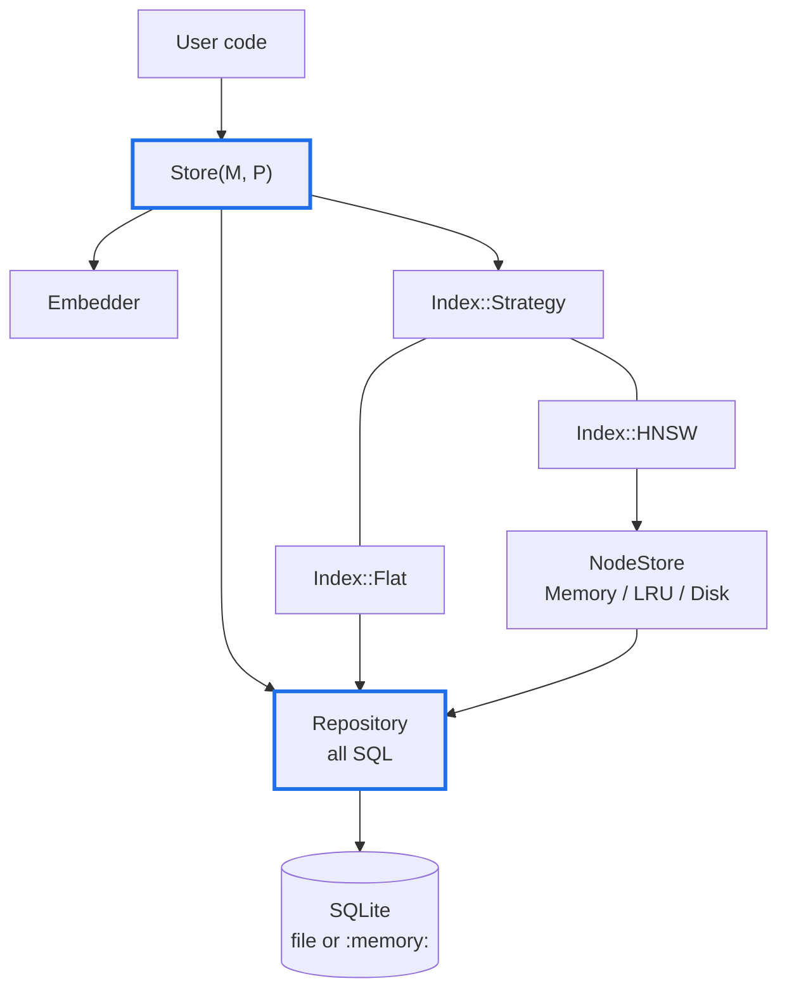
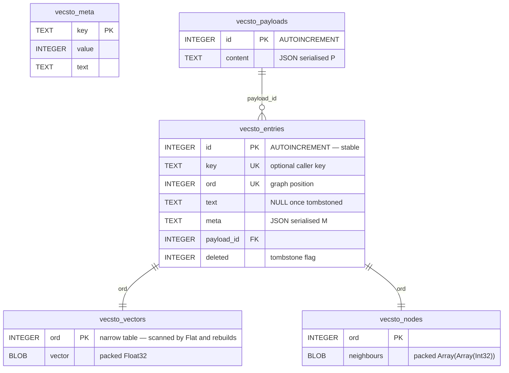
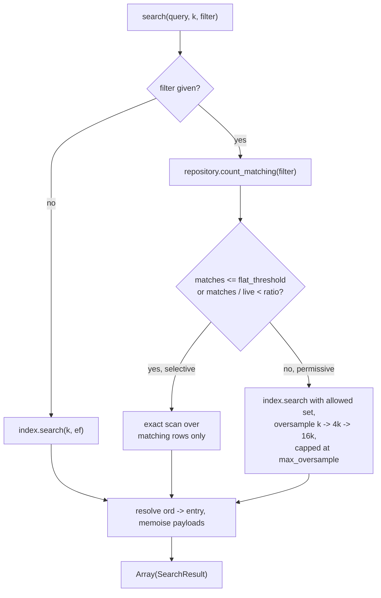

# Design: Vecstolite as of 0.7.0

Status: **proposed** — for review before implementation.

This document describes the 0.7.0 redesign of `vecstolite.cr`. It is a breaking
release: the API, the schema and the class structure all change. Databases
created by 0.6.x are not readable; re-run ingest.

**This is the last release with a free hand on the schema.** The shard's only
consumer is archived, so 0.7.0 may reshape tables at will. From 0.8.0 onward,
schema changes need migration scripts. Layout decisions that are merely
*probably* right should therefore be settled by measurement before this release
ships, not deferred — see §13.

---

## 1. Goals

1. One public store class. Backing, caching and index strategy become
   constructor arguments, not separate classes.
2. Stable entry ids that survive `compact!`, so callers can delete and update
   what they find.
3. Metadata filtering at search time.
4. Precomputed vectors accepted, and batch embedding, so ingest does not make a
   network call per row inside a write transaction.
5. Exact (flat) search available as a first-class index, both for small corpora
   and as a recall oracle for HNSW.
6. A row layout that does not drag text and metadata through the page cache on
   every vector scan (§5.1).

### Non-goals for this release

- Schema migration. Version mismatch raises; recreate the database.
- Automatic compaction. Manual `compact!` only (revisit in 0.8).
- Concurrency. Still single-threaded; the caller serialises.
- The HNSW neighbour-selection heuristic (§11).

---

## 2. What is removed

Removed                                  |Replacement                                 
-----------------------------------------|--------------------------------------------
`SQLiteVectorStore` (deprecated)         |`Store(M, P)`                               
`LinearVectorStore`                      |`Store(M, P)` with `index: Index::Flat`     
`MemoryVectorStore`                      |`Store(M, P)` opened at `":memory:"`        
`VectorStore(M)`, `IndexedVectorStore(M)`|nothing — one class needs no abstract module
`load_all_in_memory!`                    |`cache: Cache::Memory` at open              
`create` (factory)                       |`open(..., create_if_missing: true)`        

`MemoryVectorStore` held Crystal objects directly; `":memory:"` round-trips
rows through SQLite. Search is unaffected (the hot path is the node cache);
ingest into a throwaway store becomes slower. Accepted.

---

## 2.1 Target workloads

Defaults are chosen against two concrete workloads, not in the abstract.

**W1 — offline corpus RAG.** Tens of thousands of domain-specific EN/FR
translation pairs, ingested once, then queried in bulk offline. The node cache
is smaller than the corpus, so the LRU genuinely evicts. Read-dominated after
an ingest phase. Linear scan was measured as too slow at this size, which is
why the graph index exists.

**W2a — agent memory.** Many isolated store instances on one machine, each
with a tight memory budget, holding what a model cannot keep in context.
Long-lived, written and edited continuously in small increments, with routine
process restarts. Queried at agent speed — seconds between queries.

**W2b — agent knowledge.** Chunked documents augmenting user requests. One
store per agent instance, larger than W2a (10^4–10^5 chunks). Ingest is bursty
and heavy when a document is added; queries run at prompting speed.

**No current workload is latency-bound on this shard.** W1's overnight runs
were bound by local translation models, not retrieval; the user-facing
translation server was not bottlenecked here either; W2a and W2b run at
model speed. The binding constraints are therefore memory per instance, ingest
cost, and not foreclosing future options — not query latency. Design choices in
this document are weighted accordingly.

Implications carried through:

1. W2a and W2b write continuously or in bursts, so insert-path write
   amplification matters more than saving a lookup on the read path (§5.1).
2. They restart often, so a graph rebuild at open is a recurring cost rather
   than a one-off. `Cache::Memory` does not write nodes through and invites
   exactly that; `Cache::LRU` is the default (§6).
3. They run N instances per machine, so per-instance memory must be countable —
   including SQLite's own per-connection page cache, which sits outside
   `cache_max_bytes` (§6).
4. W2a accumulates tombstones with no natural maintenance window, strengthening
   the case for automatic compaction in 0.8.
5. W2a may be small enough that `Index::Flat` is the better fit — no graph, no
   `vecsto_nodes`, nothing to rebuild at open, less memory per agent. §13
   measures where that line sits rather than assuming it.

---

## 3. Architecture



**Ownership rules.** `Repository` is the only object that writes SQL. `Index`
strategies know about ordinals and vectors, never about tables. `Store`
orchestrates and owns the transaction boundary.

---

## 4. Identity: two id spaces

HNSW requires contiguous positional ids that `compact!` renumbers. Callers
require ids that never change. These are separate columns.

Column|Owner |Lifetime                                        |Visible to caller
------|------|------------------------------------------------|-----------------
`id`  |caller|permanent; never reused after delete            |yes              
`key` |caller|optional, unique; supplied at add for upsert    |yes              
`ord` |index |graph position `0..n-1`; rewritten by `compact!`|no               

An analogy: `id` is a passport number, `ord` is a seat on today's flight.
`compact!` reseats every passenger; nobody's passport changes.

Consequences:

1. `@entry_cache` is keyed by `id`, so it survives compaction instead of being
   cleared (0.6.x had to clear it because ids moved).
2. `search` translates `ord -> id` on the way out, in the same query that
   fetches text and meta.
3. `vecsto_nodes` is keyed by `ord`.

---

## 5. Schema (version 4)



`vecsto_meta` keys: `schema_version`, `m`, `ef_construction`, `dimensions`,
`encoding` (§5.3), `embedder` (name), `index_kind`, `entry_point`, `max_layer`,
`graph_saved`, `live_count`, `ord_count`.

Indexes: `ord` unique, `key` unique, `payload_id`, and one partial index on
`deleted = 0` to keep live scans cheap.

### 5.1 Why vectors get their own table

SQLite stores a row's columns contiguously. In 0.6.x the vector shares a row
with `text` and `meta`, so scanning a million vectors drags a million text
strings through the page cache — like carrying everyone's luggage because you
wanted to count heads.

For a 1024-d Float32 model the vector is ~4 KB; text and metadata might add
2–4 KB. Splitting the vector into `vecsto_vectors` therefore roughly halves the
bytes read by:

1. `Index::Flat` on every query;
2. graph rebuilds (`compact!`, index-kind change, recovery from
   `graph_saved = 0`);
3. `Cache::Memory` warm-up at open.

It also cuts the other way. Metadata filter scans (§8) now walk a table with no
4 KB blob in it, which is the difference between `json_extract` over ~200-byte
rows and over 4 KB rows. Both of the design's scan-shaped workloads get cheaper
from the same change.

**Decided: vector and neighbours stay in separate tables (layout A).** The
alternative — one `nodes(ord, vector, neighbours)` row — was considered and
rejected.

Note first that the large win above belongs to both candidates: the vector
leaves `vecsto_entries` either way, so metadata filter scans get cheap
regardless. The question was only whether vector and neighbours sit together.

Merging saves a B-tree lookup per node visit, not I/O, since both layouts read
the vector page during traversal. Against that, **SQLite rewrites an entire row
on `UPDATE`**. With the vector in the node row, every back-edge update during
an insert rewrites ~3 KB (768 dimensions, Float32) rather than ~128 bytes, and
each HNSW insert touches up to M neighbours — roughly 20× write amplification
on a path W2a and W2b use constantly.

The merged layout wins only on query latency under heavy cache eviction, which
per §2.1 is the one thing no current workload is bound by. Supporting both
would mean a permanent config axis and a doubled test surface bought to win a
race nobody is running. Layout A is simpler, right for the write-heavy
workloads, and never badly wrong for W1.

A 3 KB vector also fits inside SQLite's default 4096-byte page, so `page_size`
needs no special handling at 768 dimensions. It is fixed at creation, and
therefore inside the freeze, but 4096 is the right default here.

### 5.2 Why SQLite, still

The alternatives were weighed and rejected for this release:

Option            |Gains                |Costs                                                                                               
------------------|---------------------|----------------------------------------------------------------------------------------------------
`sqlite-vec`      |KNN in SQL           |native extension to ship; brute-force underneath, so it replaces HNSW with something slower at scale
LMDB              |zero-copy point reads|no query language, so all filtering is hand-rolled; thin Crystal bindings                           
RocksDB           |write throughput     |heavy C++ dependency; solves a write-amplification problem this shard does not have                 
DuckDB            |columnar scans       |analytics engine; awkward row-at-a-time writes; weak bindings                                       
Custom mmap format|best possible reads  |crash recovery becomes ours to write                                                                

The last row is the decisive one. The two most serious bugs found in the 0.6.1
review (§11, bugs 4 and 5) are both durability bugs in a system where SQLite
already does the hard part. Owning a file format means owning that class of bug
permanently.

**The hybrid, if measurement ever demands it:** SQLite keeps entries, payloads,
metadata and all truth about offsets; vectors and neighbours move to an
append-only mmap'd side file referenced by offset. Append-only means a crash
leaves garbage at the tail rather than corrupting live data, and SQLite's
committed offsets define what is real. This is a project, not a swap, and it is
out of scope for 0.7.0. The `Repository` (§3) is what keeps it reachable: if
every SQL string lives behind one typed collaborator, the storage engine stays
an implementation detail.

### 5.3 Vector encoding is recorded, not assumed

`vecsto_meta` carries an `encoding` key. 0.7.0 writes `f32` and reads nothing
else, but recording it now means an alternative encoding can be added later
without a schema migration — new stores use it, existing stores keep working,
and the reader dispatches on the meta value.

The candidate that matters is **int8 scalar quantisation**: a 768-dimension
vector drops from 3 KB to 768 bytes, 4× less storage, 4× more nodes per byte of
cache, and 4× less I/O per traversal. For W2a and W2b, whose binding constraint
is memory per agent instance, that is the largest single lever available —
larger than any layout choice. It costs some recall, which the §7 harness can
quantify when the time comes.

Implementing quantisation is out of scope for 0.7.0. Reserving the key costs
one row; retrofitting it costs a migration script.

---

## 6. Public API

```cr
store = Vecstolite::Store(Meta, Payload).open(
  "notes.db",
  embedder,
  index: Vecstolite::Index::HNSW.new(m: 16, ef_construction: 200),
  cache: Vecstolite::Cache.lru(512 * Vecstolite::MB),
)

Vecstolite::Store(Meta, Payload).open("notes.db", embedder) do |store|
  store.add("The sky is blue.")
end
```

### Open

```cr
def self.open(path : String,
              embedder : Embedder,
              index : Index::Strategy = Index::HNSW.new,
              cache : Cache = Cache.lru(DEFAULT_CACHE_MAX_BYTES),
              readonly : Bool = false,
              create_if_missing : Bool = true,
              verify_embedder : Bool = true,
              cache_ttl : Time::Span? = nil,
              cache_purge_period : Time::Span? = nil,
              page_cache_bytes : Int32 = DEFAULT_PAGE_CACHE_BYTES) : self

def self.open(path, embedder, **options, &) : Nil
```

**Memory accounting.** `cache_max_bytes` budgets the node cache only. SQLite
keeps its own per-connection page cache (default ~2 MB) on top, so a store's
real footprint is roughly `node cache + page cache + graph metadata +
connection overhead`. For W2 (§2.1), where N isolated instances share a
machine, `page_cache_bytes` is exposed so the total is countable rather than
discovered under memory pressure. `stats` reports the two figures separately.

**Cache mode and restart cost.** `Cache::Memory` does not write nodes through;
the graph is persisted at `close` (§10). An unclean exit forces a rebuild from
vectors at the next open — tolerable for a batch job, costly for an agent that
restarts routinely. `Cache::LRU` is therefore the default, and `Cache::Memory`
is documented as a batch-workload choice rather than simply "the fast one".

`open` creates the database when missing, mirroring `DB.open`. The block form
closes the store (flushing the graph) even when the block raises.

`verify_embedder` compares `embedder.model_name` and `dimensions` against
`vecsto_meta` and raises on mismatch. Pass `false` only if the vectors were
produced elsewhere and are known to be compatible.

### Entries

```cr
def add(text : String, meta : M? = nil, payload_id : Int64? = nil,
        key : String? = nil, vector : Embedding? = nil) : Int64

def upsert(key : String, text : String, meta : M? = nil,
           payload_id : Int64? = nil, vector : Embedding? = nil) : Int64

def get(id : Int64) : Entry(M, P)?
def get_by_key(key : String) : Entry(M, P)?
def delete(id : Int64) : Bool
def delete_by_key(key : String) : Bool
```

`add` returns the stable id. Supplying `vector` skips embedding; its dimension
is checked against the store's.

`upsert` replaces the entry with that key: the old `id` is tombstoned and a new
one issued, because the vector (and therefore the graph position) changes.
Callers holding the old id get `nil` from `get`. Stated plainly rather than
pretending ids are mutable.

### Payloads

```cr
def add_payload(payload : P) : Int64
def get_payload(id : Int64) : P?
def update_payload(id : Int64, payload : P) : Bool
def delete_payload(id : Int64) : Int32          # returns entries tombstoned
def entries_for_payload(id : Int64) : Array(Entry(M, P))
```

`update_payload` rewrites content only; no entries are re-embedded, since the
embedding derives from the entry text, not the payload.

### Bulk

```cr
def bulk(& : Batch(M, P) ->) : Nil
```

One transaction for the whole block, as today. Two changes:

1. `Batch#add` accepts `vector:`, so a caller may embed in batch beforehand.
2. `Batch#embed_all(texts : Array(String)) : Array(Embedding)` is **not**
   offered — embedding inside the transaction is what we are trying to avoid.
   Batch embedding lives on the embedder (§9) and is called before `bulk`.

### Search

```cr
def search(query : String, k : Int32 = 5,
           ef_search : Int32 = 50,
           filter : Filter? = nil) : Array(SearchResult(M, P))

def search_vector(vector : Embedding, k : Int32 = 5,
                  ef_search : Int32 = 50,
                  filter : Filter? = nil) : Array(SearchResult(M, P))

record SearchResult(M, P),
  id : Int64, key : String?, text : String, score : Float32,
  meta : M?, payload_id : Int64?, payload : P?
```

`payload_id` is exposed so a result can be deleted without a second lookup.
Payloads resolved during one `search` call are memoised, so ten results sharing
one payload cost one query, not ten (0.6.x issued one per result).

### Maintenance and observability

```cr
def size : Int32          # live entries
def ord_size : Int32      # graph slots, including tombstones
def tombstones : Int32    # ord_size - size
def compact! : Nil
def stats : NamedTuple
def close : Nil
def closed? : Bool
```

`size` means live entries — 0.6.x returned the graph slot count, tombstones
included. `live_count` is maintained in `vecsto_meta` inside the same
transaction as every insert and delete, so `size` stays O(1).

---

## 7. Index strategies

```cr
module Vecstolite::Index
  record Hit, ord : Int32, score : Float32

  abstract class Strategy
    abstract def add(ord : Int32, vector : Embedding) : Nil
    abstract def search(vector : Embedding, k : Int32, ef : Int32,
                        allowed : Set(Int32)?) : Array(Hit)
    abstract def size : Int32
    abstract def kind : Symbol
  end
end
```

**`Index::Flat`** streams vectors from the repository and scans. Exact by
construction; O(n) per query; no graph, so nothing to save or restore and
`compact!` is pure row cleanup. `allowed` is applied during the scan at no cost.

**`Index::HNSW`** is the current implementation, with the fixes in §11.
`allowed` is applied as a post-filter with oversampling (§8).

`index_kind` is recorded in meta. Opening with a different strategy than the one
stored rebuilds the index from entries rather than raising — the vectors are the
source of truth and both strategies derive from them.

**Recall harness.** Because both strategies live in one shard, recall becomes
measurable:

```
recall@k = |hnsw_hits ∩ flat_hits| / k
```

A spec asserts a floor over a fixed corpus and seed. Every future HNSW change is
then a measurement, not an argument.

---

## 8. Filtering

```cr
filter = Vecstolite::Filter.eq("language", "fr") &
         Vecstolite::Filter.in("kind", ["note", "quote"])

store.search("ciel", k: 3, filter: filter)
```

`Filter` is a small AST — `eq`, `neq`, `in`, `gt`, `gte`, `lt`, `lte`, `and`,
`or`, `not` — over JSON paths in the `meta` column, compiled to a SQL predicate
using `json_extract`. It never accepts raw SQL.

### Strategy selection

Approximate search and selective filters interact badly: you cannot walk a graph
while pretending most of its nodes are absent, because those nodes are the
roads. So the store picks per query:



Defaults: `flat_threshold = 10_000` rows, `ratio = 0.05`, `max_oversample = 3`
rounds. All three are settable at open. When the oversample cap is reached the
result is short of `k` rather than looping to a full-graph search — 0.6.x's
tombstone loop could escalate to scanning everything on every query.

Tombstone exclusion uses this same `allowed` mechanism, so there is one code
path, not two.

### Indexed meta fields (optional)

`json_extract` filters are a scan. Where that is too slow, fields may be
declared at creation:

```cr
Store(Meta, Payload).open(path, embedder, meta_index: ["language"])
```

Each becomes a SQLite generated column with an index. Declared at creation
because the store cannot introspect `M`. Deferred if implementation pressure
demands it; the `Filter` API does not change either way.

---

## 9. Embedders

```cr
module Vecstolite::Embedder
  abstract def model_name : String
  abstract def dimensions : Int32
  abstract def embed(text : String) : Embedding
  def embed_all(texts : Array(String)) : Array(Embedding)   # default: map(&embed)
end
```

1. `dimensions` must report what `embed` actually returns. `StaticEmbedder`
   currently reports `full_dims` while returning the truncated vector, which
   breaks any Matryoshka-truncated model (§11).
2. Normalisation is guaranteed by the embedder, enforced in one shared helper.
   `OpenAIEmbedder` currently does not normalise; the index assumes unit vectors
   throughout, since that is what makes cosine similarity a dot product.
3. `OpenAIEmbedder#embed_all` sends one request with an array input, instead of
   one round-trip per row.

---

## 10. Deletion, compaction and durability

`delete` and `delete_payload` tombstone. Stable ids do not remove the need for
this: the reason is graph connectivity, not id arithmetic. A deleted node's
*edges* vanish with it, and upper-layer nodes are the express lanes — removing
one can silently sever the route to a live region, or orphan the entry point.
The `vecsto_vectors` row survives deletion as a routing waypoint; `text`, `meta`
and `payload_id` are nulled in `vecsto_entries` at delete time, so that space
returns immediately and `compact!` reclaims only the vector and the graph slot.

The split makes this cleaner than it was: deletion now clears columns in a
narrow table and leaves the two wide, `ord`-keyed tables untouched until
compaction.

`compact!` rewrites `ord` over survivors, clears `vecsto_nodes`, rebuilds the
graph, and leaves `id` and `key` untouched.

**Transaction rule (one rule, stated once).** Any operation that changes the
`ord` space or the graph topology writes its graph meta — `entry_point`,
`max_layer`, `graph_saved`, `live_count`, `ord_count` — inside the same
transaction. 0.6.x's `compact!` committed the renumbered rows and then wrote
meta in a second transaction; a crash between the two leaves a stale entry point
that may be out of range, so every subsequent search fails.

In-memory node caching does not write nodes through. Any operation that mutates
the graph under `Cache::Memory` therefore sets `graph_saved = 0` in its
transaction and `close`/`save_graph` sets it back to 1. A crash then falls back
to a rebuild from entries: slow, always correct. 0.6.x left `graph_saved = 1`
after `load_all_in_memory!` plus `add`, so entries committed but their nodes did
not, and those entries became invisible to search.

---

## 11. Bugs folded into this work

#|Bug                                                      |Where               
--|---------------------------------------------------------|--------------------
1|`StaticEmbedder#dimensions` ignores `truncate_dims`      |§9                  
2|No embedder/dimension check on open                      |§6 `verify_embedder`
3|`OpenAIEmbedder` does not L2-normalise                   |§9                  
4|`compact!` writes graph meta outside its transaction     |§10                 
5|Memory-cache `add` leaves `graph_saved = 1`              |§10                 
6|`random_layer` uses p = 1/e, not 1/M (`@ml` unused)      |`Index::HNSW`       
7|`MemoryVectorStore#clear` references a missing getter    |class removed       
8|Search issues one payload query per result               |§6 memoisation      
9|Dead code: `truncate_to`, `Candidate#<=>`, `Index#export`|removed             

Bug 6 changes graph shape: at M = 16 roughly 37% of nodes currently reach layer
1 or above, against about 6% under the standard formula. The recall harness
(§7) measures the effect rather than assuming it.

**Deferred to 0.8:** HNSW's diversity heuristic for neighbour selection
(Malkov Algorithm 4). Today's "nearest M" can leave a node whose neighbours all
sit in one cluster with no edge out of it. Worth doing with the recall harness
in place, not before.

---

## 12. Implementation plan

1. **Delete the old stores.** Remove `SQLiteVectorStore`, `LinearVectorStore`,
   `MemoryVectorStore`, `VectorStore(M)`, `IndexedVectorStore(M)` and their
   specs. Pure subtraction; the tree compiles smaller.
2. **`Repository` + schema 4.** Extract every SQL string; add `id`/`key`/`ord`;
   node stores take the repository instead of table names.
3. **`Store(M, P)`.** Rebuild the public surface on the repository: open/block
   form, entry and payload CRUD, bulk, search, compact, stats. Bugs 2, 4, 5, 8.
4. **`Index::Strategy`.** Extract HNSW behind the interface, add `Flat`, add the
   recall harness. Bugs 6, 9.
5. **Embedders.** Batch embedding, shared normalisation, honest `dimensions`.
   Bugs 1, 3.
6. **Filtering.** `Filter` AST, strategy selection, tombstones routed through
   the same `allowed` mechanism.
7. **Benchmarks (§13).** Extend `samples/benchmark.cr`; produce the cache
   sizing curve and settle the Flat/HNSW crossover while the schema is still
   free.
8. **Docs and release.** Rewrite `README.md` and `DEVELOPMENT.md`, refresh the
   samples, bump to 0.7.0, write release notes.

Steps 1 and 2 are the riskiest to review in one lump; they can be two PRs on the
feature branch if the diff gets unwieldy. Step 7 must land before step 8: a
schema choice made after release is a migration script.

---

## 13. Benchmarks

`samples/benchmark.cr` measures none of what the remaining choices depend on.
Since no workload is latency-bound (§2.1), the goal is not to crown a design
but to find the cliffs and produce sizing guidance — the cache has never been
exercised in a way that would reveal either.

All runs at 768 dimensions, Float32, across `Cache::Memory`, `Cache::LRU` and
`Cache::Disk`, at ~10^3 / 10^4 / 10^5 entries.

1. **Cache sizing curve (primary).** Query latency and cache hit rate against
   node-cache budget: 0.5 MB, 5 MB, 50 MB, and "fits entirely". At ~3 KB per
   node, 0.5 MB holds about 170 nodes — which is what W1 actually ran with.
   The deliverable is a README rule of the form "budget X per 1,000 entries for
   hit rate Y".
2. **Per-instance footprint.** Resident memory of an open store against corpus
   size and cache budget, with SQLite's page cache counted separately. Answers
   how many agent instances fit on one machine, which is W2a's and W2b's real
   constraint.
3. **Ingest cost.** Bytes written and wall time per `add` at steady state, and
   for a bursty document-chunk batch (W2b). Confirms that layout A's cheap
   back-edge updates behave as §5.1 predicts.
4. **Open and restart cost.** Time to first query after a clean close and after
   a simulated unclean exit, per cache mode. Confirms `Cache::LRU` as the
   default with a number attached.
5. **Flat/HNSW crossover.** Latency and recall as the corpus grows, plus the
   footprint difference of running without a graph at all. Answers open
   question 1 and, specifically, whether a W2a memories store should default
   to Flat.
6. **Delete and compact.** `compact!` cost against tombstone ratio, and query
   latency as tombstones accumulate. Gives `max_oversample` (§8) an empirical
   basis and sizes the 0.8 auto-compaction threshold.

Results are recorded in `DEVELOPMENT.md` with machine, Crystal version and
corpus described, so later numbers are comparable rather than merely newer.

---

## 14. Open questions

1. Should `Index::Flat` be the default for small stores, chosen automatically
   below some row count, or always explicit?
2. Should `upsert` be offered at all, given that it invalidates the old `id`,
   or should callers delete and add so the id change is unmissable?
3. Is `meta_index` (§8) worth building in 0.7.0, or does the plain
   `json_extract` path carry the experimental workload for now?

Question 1 is settled by §13's benchmarks and must close before release, since
it shapes a default. Questions 2 and 3 are API judgement calls and can close at
review. The layout question (A vs B) and the profiles argument are both
closed — see §5.1 and §6.
