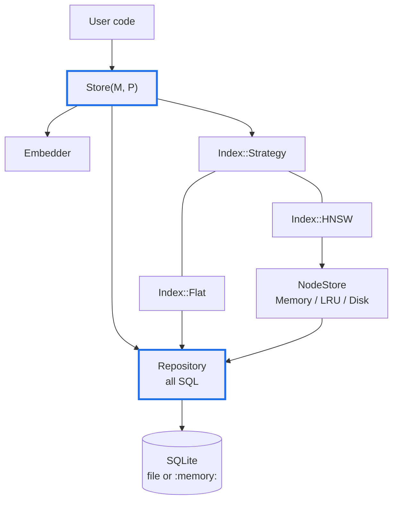
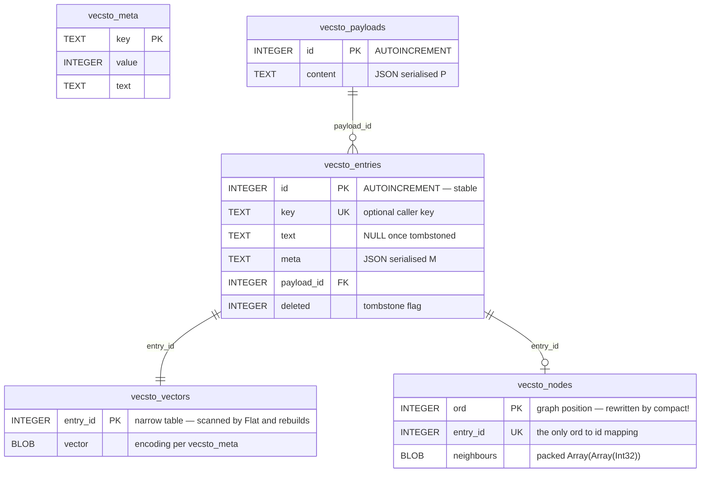

# Design: Vecstolite 0.7.0

Status: **accepted, as built** — reconciled with the implementation on the
`redesign-for-0.7.0` branch. Where the build departed from the original
proposal, the text below describes what was built and says why. Outstanding
work lives in `SCOPE.md`, not here.

This document describes the 0.7.0 redesign of `vecstolite.cr`. It is a breaking
release: the API, the schema and the class structure all change. Databases
created by 0.6.x are not readable; re-run ingest.

**This is the last release with a free hand on the schema.** The shard's only
consumer is archived, so 0.7.0 may reshape tables at will. From 0.8.0 onward,
schema changes need migration scripts. Layout decisions that are merely
*probably* right should therefore be settled by measurement before this release
ships, not deferred — see §13.

---

## 1. Goals

1. One public store class. Backing, caching and index strategy become
   constructor arguments, not separate classes.
2. Stable entry ids that survive `compact!`, so callers can delete and update
   what they find.
3. Metadata filtering at search time.
4. Precomputed vectors accepted, and batch embedding, so ingest does not make a
   network call per row inside a write transaction.
5. Exact (flat) search available as a first-class index, both for small corpora
   and as a recall oracle for HNSW.
6. A row layout that does not drag text and metadata through the page cache on
   every vector scan (§5.1).

### Non-goals for this release

- Schema migration. Version mismatch raises; recreate the database.
- Automatic compaction. Manual `compact!` only (revisit in 0.8).
- Concurrency. Still single-threaded; the caller serialises.
- The HNSW neighbour-selection heuristic (§11).

---

## 2. What is removed

Removed                                  |Replacement                                 
-----------------------------------------|--------------------------------------------
`SQLiteVectorStore` (deprecated)         |`Store(M, P)`                               
`LinearVectorStore`                      |`Store(M, P)` with `index: Index.flat`      
`MemoryVectorStore`                      |`Store(M, P)` opened at `":memory:"`        
`VectorStore(M)`, `IndexedVectorStore(M)`|nothing — one class needs no abstract module
`load_all_in_memory!`                    |`cache: CacheMode.memory` at open           
`create` (factory)                       |`open(..., create_if_missing: true)`        

`MemoryVectorStore` held Crystal objects directly; `":memory:"` round-trips
rows through SQLite. Search is unaffected (the hot path is the node cache);
ingest into a throwaway store becomes slower. Accepted.

---

## 2.1 Target workloads

Defaults are chosen against two concrete workloads, not in the abstract.

**W1 — offline corpus RAG.** Tens of thousands of domain-specific EN/FR
translation pairs, ingested once, then queried in bulk offline. The node cache
is smaller than the corpus, so the LRU genuinely evicts. Read-dominated after
an ingest phase. Linear scan was measured as too slow at this size, which is
why the graph index exists.

**W2a — agent memory.** Many isolated store instances on one machine, each
with a tight memory budget, holding what a model cannot keep in context.
Long-lived, written and edited continuously in small increments, with routine
process restarts. Queried at agent speed — seconds between queries.

**W2b — agent knowledge.** Chunked documents augmenting user requests. One
store per agent instance, larger than W2a (10^4–10^5 chunks). Ingest is bursty
and heavy when a document is added; queries run at prompting speed.

**No current workload is latency-bound on this shard.** W1's overnight runs
were bound by local translation models, not retrieval; the user-facing
translation server was not bottlenecked here either; W2a and W2b run at
model speed. The binding constraints are therefore memory per instance, ingest
cost, and not foreclosing future options — not query latency. Design choices in
this document are weighted accordingly.

Implications carried through:

1. W2a and W2b write continuously or in bursts, so insert-path write
   amplification matters more than saving a lookup on the read path (§5.1).
2. They restart often, so a graph rebuild at open is a recurring cost rather
   than a one-off. `CacheMode.memory` does not write nodes through and
   invites exactly that; `CacheMode.lru` is the default (§6).
3. They run N instances per machine, so per-instance memory must be countable —
   including SQLite's own per-connection page cache, which sits outside
   `cache_max_bytes` (§6).
4. W2a accumulates tombstones with no natural maintenance window, strengthening
   the case for automatic compaction in 0.8.
5. W2a may be small enough that `Index::Flat` is the better fit — no graph, no
   `vecsto_nodes`, nothing to rebuild at open, less memory per agent. §13
   measures where that line sits rather than assuming it.

---

## 3. Architecture



**Ownership rules.** `Repository` is the only object that writes SQL. `Index`
strategies know about ordinals and vectors, never about tables. `Store`
orchestrates and owns the transaction boundary.

---

## 4. Identity: two id spaces

HNSW requires contiguous positional ids that `compact!` renumbers. Callers
require ids that never change. These are separate columns.

Column|Owner |Lifetime                                                                       |Visible to caller
------|------|-------------------------------------------------------------------------------|-----------------
`id`  |caller|permanent; never reused after delete                                           |yes              
`key` |caller|optional, unique; supplied at add for upsert                                   |yes              
`ord` |index |graph position `0..n-1`; rewritten by `compact!`; stored only in `vecsto_nodes`|no               

An analogy: `id` is a passport number, `ord` is a seat on today's flight.
`compact!` reseats every passenger; nobody's passport changes.

Consequences:

1. `@entry_cache` is keyed by `id`, so it survives compaction instead of being
   cleared (0.6.x had to clear it because ids moved).
2. `search` translates `ord -> id` on the way out, in the same query that
   fetches text and meta.
3. `vecsto_nodes` is keyed by `ord` and carries the `entry_id` it stands for.
   That row is the only place the two id spaces meet, so they cannot drift.
4. `vecsto_vectors` is keyed by `entry_id`, not `ord`, so vectors never move.
   Compaction renumbers the small nodes table (which it rebuilds anyway)
   instead of rewriting every vector row.

---

## 5. Schema (version 4)



`vecsto_meta` keys: `schema_version`, `dimensions`, `encoding` (§5.3),
`embedder` (name), `index_kind`, `m`, `ef_construction`, `entry_point`,
`max_layer`, `graph_saved`, `live_count`. The proposal also listed `ord_count`,
which the node table's row count made redundant.

Indexes: `key` unique and `entry_id` unique (both by constraint), `payload_id`,
and one partial index on `deleted = 0` to keep live scans cheap.

An index strategy that needs no graph — `Index::Flat` — simply leaves
`vecsto_nodes` empty and works from `vecsto_vectors`, which yields stable ids
directly.

### 5.1 Why vectors get their own table

SQLite stores a row's columns contiguously. In 0.6.x the vector shares a row
with `text` and `meta`, so scanning a million vectors drags a million text
strings through the page cache — like carrying everyone's luggage because you
wanted to count heads.

For a 1024-d Float32 model the vector is ~4 KB; text and metadata might add
2–4 KB. Splitting the vector into `vecsto_vectors` therefore roughly halves the
bytes read by:

1. `Index::Flat` on every query;
2. graph rebuilds (`compact!`, index-kind change, recovery from
   `graph_saved = 0`);
3. `CacheMode.memory` warm-up at open.

It also cuts the other way. Metadata filter scans (§8) now walk a table with no
4 KB blob in it, which is the difference between `json_extract` over ~200-byte
rows and over 4 KB rows. Both of the design's scan-shaped workloads get cheaper
from the same change.

**Decided: vector and neighbours stay in separate tables (layout A).** The
alternative — one `nodes(ord, vector, neighbours)` row — was considered and
rejected.

Note first that the large win above belongs to both candidates: the vector
leaves `vecsto_entries` either way, so metadata filter scans get cheap
regardless. The question was only whether vector and neighbours sit together.

Merging saves a B-tree lookup per node visit, not I/O, since both layouts read
the vector page during traversal. Against that, **SQLite rewrites an entire row
on `UPDATE`**. With the vector in the node row, every back-edge update during
an insert rewrites ~3 KB (768 dimensions, Float32) rather than ~128 bytes, and
each HNSW insert touches up to M neighbours — roughly 20× write amplification
on a path W2a and W2b use constantly.

The merged layout wins only on query latency under heavy cache eviction, which
per §2.1 is the one thing no current workload is bound by. Supporting both
would mean a permanent config axis and a doubled test surface bought to win a
race nobody is running. Layout A is simpler, right for the write-heavy
workloads, and never badly wrong for W1.

A 3 KB vector also fits inside SQLite's default 4096-byte page, so `page_size`
needs no special handling at 768 dimensions. It is fixed at creation, and
therefore inside the freeze, but 4096 is the right default here.

### 5.2 Why SQLite, still

The alternatives were weighed and rejected for this release:

Option            |Gains                |Costs                                                                                               
------------------|---------------------|----------------------------------------------------------------------------------------------------
`sqlite-vec`      |KNN in SQL           |native extension to ship; brute-force underneath, so it replaces HNSW with something slower at scale
LMDB              |zero-copy point reads|no query language, so all filtering is hand-rolled; thin Crystal bindings                           
RocksDB           |write throughput     |heavy C++ dependency; solves a write-amplification problem this shard does not have                 
DuckDB            |columnar scans       |analytics engine; awkward row-at-a-time writes; weak bindings                                       
Custom mmap format|best possible reads  |crash recovery becomes ours to write                                                                

The last row is the decisive one. The two most serious bugs found in the 0.6.1
review (§11, bugs 4 and 5) are both durability bugs in a system where SQLite
already does the hard part. Owning a file format means owning that class of bug
permanently.

**The hybrid, if measurement ever demands it:** SQLite keeps entries, payloads,
metadata and all truth about offsets; vectors and neighbours move to an
append-only mmap'd side file referenced by offset. Append-only means a crash
leaves garbage at the tail rather than corrupting live data, and SQLite's
committed offsets define what is real. This is a project, not a swap, and it is
out of scope for 0.7.0. The `Repository` (§3) is what keeps it reachable: if
every SQL string lives behind one typed collaborator, the storage engine stays
an implementation detail.

### 5.3 Vector encoding is recorded, not assumed

`vecsto_meta` carries an `encoding` key. 0.7.0 writes `f32` and reads nothing
else, but recording it now means an alternative encoding can be added later
without a schema migration — new stores use it, existing stores keep working,
and the reader dispatches on the meta value.

The candidate that matters is **int8 scalar quantisation**: a 768-dimension
vector drops from 3 KB to 768 bytes, 4× less storage, 4× more nodes per byte of
cache, and 4× less I/O per traversal. For W2a and W2b, whose binding constraint
is memory per agent instance, that is the largest single lever available —
larger than any layout choice. It costs some recall, which the §7 harness can
quantify when the time comes.

Implementing quantisation is out of scope for 0.7.0. Reserving the key costs
one row; retrofitting it costs a migration script.

---

## 6. Public API

```cr
store = Vecstolite::Store(Meta, Payload).open(
  "notes.db",
  embedder,
  index: Vecstolite::Index.hnsw(m: 16, ef_construction: 200),
  cache: Vecstolite::CacheMode.lru(256 * Vecstolite::MB),
)

Vecstolite::Store(Meta, Payload).open("notes.db", embedder) do |store|
  store.add("The sky is blue.")
end
```

### Open

```cr
def self.open(path : String,
              embedder : VectorEmbedder,
              index : Index::Config = Index.hnsw,
              cache : CacheMode = CacheMode.lru,
              readonly : Bool = false,
              create_if_missing : Bool = true,
              verify_embedder : Bool = true,
              page_cache_bytes : Int64 = Repository::DEFAULT_PAGE_CACHE_BYTES,
              oversample_rounds : Int32 = DEFAULT_OVERSAMPLE_ROUNDS) : self

def self.open(..., &) : Nil   # same arguments; closes even if the block raises
```

`index` and `cache` are *descriptions*, not built objects: a strategy needs the
repository and node cache that only exist once the store opens, so
`Index.hnsw(...)` returns a `Config` the store builds from. The proposal passed
`Index::HNSW.new` directly, which could not work.

**HNSW parameters are stored, and reused.** `m` and `ef_construction` are
written at creation. Left unset on a later open, they take what the store was
built with, so a bare `Index.hnsw` never silently changes a graph built with
non-default settings. An explicit `m` that differs rebuilds the graph, since a
graph cannot be extended with a different edge limit. A different
`ef_construction` is simply recorded: it shapes how carefully future inserts
search, not what the graph is. Parameters are recorded only after the index is
in place, so a rebuild that fails cannot leave metadata describing a graph
that was never built.

**`CacheMode`, not `Cache`.** The proposal said `Cache.lru(...)`. At the time a
top-level `Cache(K, V)` existed for the entry cache, so the new type took the
longer name. That class is gone and the rename is now possible; `CacheMode` was
kept because it says what it is — a choice of mode, not a cache.

The proposal's `cache_ttl` and `cache_purge_period` belonged to the removed
entry cache and are gone with it.

**Memory accounting.** The `CacheMode.lru` budget covers graph nodes only.
SQLite keeps its own per-connection page cache (default ~2 MB) on top, so a
store's real footprint is roughly `node cache + page cache + connection
overhead`. For W2 (§2.1), where N isolated instances share a machine,
`page_cache_bytes` is exposed so the total is countable rather than discovered
under memory pressure.

**Cache mode and restart cost.** `CacheMode.memory` does not write nodes
through; the graph is persisted at `close` (§10). An unclean exit forces a
rebuild from vectors at the next open — tolerable for a batch job, costly for
an agent that restarts routinely. `CacheMode.lru` is therefore the default, and
`memory` is documented as a batch-workload choice rather than "the fast one".

`verify_embedder` compares the embedder's name and dimensions against
`vecsto_meta` and raises on mismatch.

`oversample_rounds` bounds how hard a search works to replace deleted entries
(§10). It is an argument rather than a constant so that filtering, when it
arrives, can sit alongside its own thresholds without changing the signature.

### Entries

```cr
def add(text : String, meta : M? = nil, payload_id : Int64? = nil,
        key : String? = nil, vector : Embedding? = nil) : Int64

def get(id : Int64) : Entry(M, P)?
def get_by_key(key : String) : Entry(M, P)?
def delete(id : Int64) : Bool
def delete_by_key(key : String) : Bool
```

`add` returns the stable id. Supplying `vector` skips embedding; its dimension
is checked against the store's.

`upsert` was proposed and deferred — see §14.

### Payloads

```cr
def add_payload(payload : P) : Int64
def get_payload(id : Int64) : P?
def update_payload(id : Int64, payload : P) : Bool
def delete_payload(id : Int64) : Int32   # entries tombstoned
```

`update_payload` rewrites content only; no entries are re-embedded, since the
embedding derives from the entry text, not the payload.

The proposed `entries_for_payload` was not built; nothing needed it.

### Bulk

```cr
def bulk(& : Batch(M, P) ->) : Nil

store.bulk do |batch|
  pair = batch.add_payload(Translation.new("The sky is blue.", "Le ciel est bleu."))
  batch.add("The sky is blue.", payload_id: pair)
  batch.add("Le ciel est bleu.", payload_id: pair)
end
```

One transaction for entries *and* the payloads they share. Embedding happens
before the transaction opens, via `embed_all`, so a slow embedder never holds
the write lock.

Because inserts are deferred until embedding is done, a payload queued in a
batch has no id yet. `Batch#add_payload` returns a placeholder that
`Batch#add` accepts in place of an id, and the store resolves it inside the
transaction. A placeholder is only valid in the batch that issued it. This
differs from 0.6.x, where inserts happened immediately and `add_payload`
returned a real id.

### Search

```cr
def search(query : String, k : Int32 = 5,
           ef_search : Int32 = 50) : Array(SearchResult(M, P))

def search_vector(vector : Embedding, k : Int32 = 5,
                  ef_search : Int32 = 50) : Array(SearchResult(M, P))

record SearchResult(M, P),
  id : Int64, key : String?, text : String, score : Float32,
  meta : M?, payload_id : Int64?, payload : P?
```

`payload_id` is exposed so a result can be deleted without a second lookup.
Payloads resolved during one search are fetched once however many results
share them.

The `filter:` argument is deferred with filtering itself (§8). Adding a
defaulted argument later is not a breaking change.

### Maintenance and observability

```cr
def size : Int32         # live entries
def total : Int32        # entry rows, tombstones included
def tombstones : Int32   # total - size
def compact! : Nil
def stats : NamedTuple
def close : Nil
def closed? : Bool
```

`size` means live entries — 0.6.x returned the graph slot count, tombstones
included. `live_count` is maintained in `vecsto_meta` inside the same
transaction as every insert and delete, so `size` stays O(1). The proposal's
`ord_size` became `total`, which counts entry rows: graph positions are not
something a caller should need to know exist.

---

## 7. Index strategies

```cr
module Vecstolite::Index
  record Hit, entry_id : Int64, score : Float32

  abstract class Strategy
    abstract def add(entry_id : Int64, vector : Embedding) : Nil
    abstract def search(vector : Embedding, k : Int32, ef : Int32,
                        allowed : Set(Int64)?) : Array(Hit)
    abstract def size : Int32   # the most hits a search could return
    abstract def kind : Symbol
    abstract def flush : Nil
    abstract def clear : Nil
  end
end
```

**Hits carry entry ids, not graph positions.** The proposal had `Hit` report
`ord`. Writing `Flat` settled it: an exact scan has no ords to report. So `HNSW`
maps each result back through its node cache, `Flat` reports what it already
has, and graph positions never leave the index layer. `allowed` is a set of
entry ids both strategies can apply the same way.

**`Index::Flat`** scans `vecsto_vectors`. Exact by construction, O(n) per
query, no graph — nothing to save, restore or rebuild, and `compact!` is pure
row cleanup.

**`Index::HNSW`** is the graph index, with the corrections in §11.

`index_kind` is recorded in meta. Opening with a different strategy rebuilds
the index from the stored vectors rather than raising, since the vectors are
the source of truth. Switching *to* Flat discards the old graph, which would
otherwise go stale as entries are added.

**HNSW is the default at every size.** The question was whether small stores —
W2a's memories, say — should default to Flat. Measured at 768 dimensions, the
graph answers in 0.13 ms against Flat's 6.50 ms at a thousand entries, and
0.31 ms against 45.36 ms at ten thousand. The crossover sits below a thousand
entries, so there is no size at which defaulting to an exact scan makes sense.
Flat is the exact option and the oracle. Figures and conditions are recorded in
`DEVELOPMENT.md`.

**Recall harness.** Because both strategies live in one shard, recall is
measurable rather than arguable:

```
recall@k = |hnsw_hits ∩ flat_hits| / k
```

`spec/unit/index/hnsw_spec.cr` asserts a floor over a fixed, seeded corpus.
Three properties make it discriminating, each learned by the harness reporting
a useless 1.0: queries held out of the corpus, clustered rather than uniform
vectors, and a beam far narrower than the corpus. A companion assertion fails
if recall ever reaches exactly 1.0, since that means the harness has stopped
measuring anything.

Where scores tie — sparse embeddings tie constantly — set overlap undercounts,
because Flat and HNSW each return a different, equally good answer. The
benchmark reports score parity alongside it for that reason.

---

## 8. Filtering

> **Deferred to after 0.7.0.** Filtering is net new capability rather than core
> to storing and finding vectors, and no current workload needs it. Nothing
> about deferring it is expensive: `meta` is already JSON, the selectivity
> routing touches no schema, and `filter:` can be added to `search` as a
> defaulted argument without breaking callers. The design below stands as the
> plan.

```cr
filter = Vecstolite::Filter.eq("language", "fr") &
         Vecstolite::Filter.in("kind", ["note", "quote"])

store.search("ciel", k: 3, filter: filter)
```

`Filter` is a small AST — `eq`, `neq`, `in`, `gt`, `gte`, `lt`, `lte`, `and`,
`or`, `not` — over JSON paths in the `meta` column, compiled to a SQL predicate
using `json_extract`. It never accepts raw SQL.

### Strategy selection

Approximate search and selective filters interact badly: you cannot walk a graph
while pretending most of its nodes are absent, because those nodes are the
roads. So the store picks per query:


Defaults: `flat_threshold = 10_000` rows, `ratio = 0.05`, `oversample_rounds = 3`
rounds. All three are settable at open. When the oversample cap is reached the
result is short of `k` rather than looping to a full-graph search — 0.6.x's
tombstone loop could escalate to scanning everything on every query.

Tombstone exclusion uses this same `allowed` mechanism, so there is one code
path, not two.

### Indexed meta fields (optional)

`json_extract` filters are a scan. Where that is too slow, fields may be
declared at creation:

```cr
Store(Meta, Payload).open(path, embedder, meta_index: ["language"])
```

Each becomes a SQLite generated column with an index. Declared at creation
because the store cannot introspect `M`. Deferred if implementation pressure
demands it; the `Filter` API does not change either way.

---

## 9. Embedders

```cr
module Vecstolite::Embedder
  abstract def model_name : String
  abstract def dimensions : Int32
  abstract def embed(text : String) : Embedding
  def embed_all(texts : Array(String)) : Array(Embedding)   # default: map(&embed)
end
```

1. `dimensions` must report what `embed` actually returns. `StaticEmbedder`
   currently reports `full_dims` while returning the truncated vector, which
   breaks any Matryoshka-truncated model (§11).
2. Normalisation is guaranteed by the embedder, enforced in one shared helper.
   `OpenAIEmbedder` currently does not normalise; the index assumes unit vectors
   throughout, since that is what makes cosine similarity a dot product.
3. `OpenAIEmbedder#embed_all` sends one request with an array input, instead of
   one round-trip per row.

---

## 10. Deletion, compaction and durability

`delete` and `delete_payload` tombstone. Stable ids do not remove the need for
this: the reason is graph connectivity, not id arithmetic. A deleted node's
*edges* vanish with it, and upper-layer nodes are the express lanes — removing
one can silently sever the route to a live region, or orphan the entry point.

So the entry's vector and graph node survive deletion as a routing waypoint,
while `text`, `meta` and `payload_id` are nulled at delete time. Most of the
space returns immediately; `compact!` reclaims the vector and the graph slot.

Search filters tombstones at the result layer. It asks the index for more hits
than it needs, widening fourfold per round, for at most `oversample_rounds`
rounds (default 3). Past that it returns fewer than `k` rather than escalating
to a whole-graph scan — 0.6.x's unbounded loop turned a heavily tombstoned
store into a latency cliff on every query.

`compact!` runs in one transaction:

1. Clear the graph. Its nodes reference the entry rows about to go, and every
   position is invalid after a rebuild anyway.
2. Purge tombstoned rows and their vectors.
3. Rebuild the graph from surviving vectors.
4. Flush, and record the graph metadata as saved.

Ids and keys are untouched, which is what makes compaction safe to run without
coordinating with callers. The order in step 1 matters and is easy to get
wrong: the first draft purged first, and the foreign key from `vecsto_nodes`
rejected it. `Repository#purge_tombstoned` now also deletes dependent node
rows itself, so it is safe to call in any order — but that is a guard, not a
substitute for the rebuild, since removing individual nodes leaves holes in
`ord`.

**Transaction rule (one rule, stated once).** Any operation that changes the
`ord` space or the graph topology writes its graph metadata — `entry_point`,
`max_layer`, `graph_saved`, `live_count` — inside the same transaction as the
rows those values describe. 0.6.x's `compact!` committed the renumbered rows
and then wrote metadata in a second transaction; a crash between the two left
a stale entry point, and every subsequent search failed.

Every write records `graph_saved` as whether the node cache writes through.
Under `CacheMode.memory` that is 0, and only `close` or `compact!` — both of
which flush inside their transaction — set it to 1. A crash therefore falls
back to a rebuild from vectors: slow, always correct. 0.6.x left
`graph_saved = 1` after `load_all_in_memory!` plus `add`, so entries committed
but their nodes did not, and those entries became invisible to search.

**A failed write rebuilds the index.** A rolled-back transaction restores the
rows but not the strategy's in-memory state, so the store discards the index
and rebuilds from the surviving vectors rather than tracking individual graph
mutations to undo.

**The LRU cache must hold the object it last persisted.** A node held across
an eviction can be read back as a second, stale object; if that copy is later
written, it overwrites the real neighbour lists and silently strips edges from
the graph. `NodeCache::LRU#write_back` reseats the cache to the object it just
wrote. This bug predates 0.7.0 and only appears under real eviction — which is
how W1 ran — so the volume specs compare a graph built under constant eviction
against one built with room to spare.

---

## 11. Bugs folded into this work

All fixed.

# |Bug                                                      |Fix                              
--|---------------------------------------------------------|---------------------------------
1 |`StaticEmbedder#dimensions` ignores `truncate_dims`      |reports truncated width (§9)     
2 |No embedder or dimension check on open                   |`verify_embedder` (§6)           
3 |`OpenAIEmbedder` does not L2-normalise                   |normalised on arrival (§9)       
4 |`compact!` writes graph meta outside its transaction     |one transaction (§10)            
5 |Memory-cache `add` leaves `graph_saved = 1`              |records write-through state (§10)
6 |`random_layer` uses p = 1/e, not 1/m (`@ml` unused)      |exponential draw with `@ml`      
7 |`MemoryVectorStore#clear` references a missing getter    |class removed                    
8 |Search issues one payload query per result               |fetched once per search          
9 |Dead code: `truncate_to`, `Candidate#<=>`, `Index#export`|removed                          
10|LRU cache serves a stale node after eviction             |`write_back` reseats (§10)       
11|Neighbour selection drops duplicate vectors              |ties kept, as in hnswlib         

Bugs 10 and 11 were found during implementation: 10 by a volume spec that
happened to run unseeded, and 11 by a benchmark corpus that duplicated itself
by accident. Duplicate recall was 0.79 with a strict distance comparison in the
diversity rule, since every copy after the first looked redundant; it is 1.0
with ties kept, and ordinary recall is unchanged at 0.976.

**The neighbour-selection heuristic landed in this release**, not 0.8 as
proposed. Bug 6 could not be fixed without it. Measured against Flat on
clustered data (2,000 vectors, 32 dimensions, 50 clusters, m=8,
ef_construction=64, ef=5, k=5):

&nbsp;              |layer p = 1/e|layer p = 1/m
--------------------|-------------|-------------
nearest-m neighbours|0.752        |0.572        
diversity neighbours|0.936        |**0.976**    

Judged alone, the correct layer draw looked like a 24% recall regression: the
surplus upper layers had been compensating for a base graph whose edges all
pointed inward. With diverse neighbours the base graph routes on its own, and
the shorter graph is both better and cheaper to insert into.

---

## 12. Delivery

Built in the proposed order with two exceptions: the index extraction was
pulled forward into the store work, to avoid adapting the old indexer to the
new node cache only to replace it; and filtering was deferred (§8). Each step
kept the tree compiling and green by building the new layer alongside the old
one, then deleting the old in a separate commit.

What remains before release is tracked in `SCOPE.md`.

---

## 13. Benchmarks

`samples/benchmark.cr` runs six suites. Since no workload is latency-bound
(§2.1), the goal is not to crown a design but to find the cliffs and produce
sizing guidance.

Runs are at 768 dimensions, Float32, across `CacheMode.memory`, `lru` and
`disk`, at 10^3 and 10^4 entries. The benchmark defaults to `LexicalEmbedder`
over a synthetic corpus so it runs anywhere, and seeds the graph so runs are
comparable.

1. **Cache sizing curve (primary).** Query latency and cache hit rate against
   node-cache budget: 0.5 MB, 5 MB, 50 MB, and "fits entirely". At ~3 KB per
   node, 0.5 MB holds about 170 nodes — which is what W1 actually ran with.
   The deliverable is a README rule of the form "budget X per 1,000 entries for
   hit rate Y".
2. **Per-instance footprint.** Resident memory of an open store against corpus
   size and cache budget, with SQLite's page cache counted separately. Answers
   how many agent instances fit on one machine, which is W2a's and W2b's real
   constraint.
3. **Ingest cost.** Bytes written and wall time per `add` at steady state, and
   for a bursty document-chunk batch (W2b). Confirms that layout A's cheap
   back-edge updates behave as §5.1 predicts.
4. **Open and restart cost.** Time to first query after a clean close and after
   a simulated unclean exit, per cache mode. Confirms `CacheMode.lru` as the
   default with a number attached.
5. **Flat/HNSW crossover.** *Done* — the graph wins at every size measured;
   see §7.
6. **Delete and compact.** `compact!` cost against tombstone ratio, and query
   latency as tombstones accumulate. Gives `oversample_rounds` an empirical
   basis and sizes the automatic-compaction threshold.

Results are recorded in `DEVELOPMENT.md` with machine, Crystal version and
corpus described, so later numbers are comparable rather than merely newer.

---

## 14. Open questions

1. ~~Should `Index::Flat` be the default for small stores?~~ **Closed: no.** The
   graph is faster at every size measured (§7).
2. ~~Should `upsert` be offered?~~ **Deferred from 0.7.0.** A new vector means
   a new graph position, so `upsert` would return a different id than the
   entry had — a trap for callers holding the old one. Delete-then-add makes
   the change unmissable. Adding it later is not a breaking change.
3. ~~Is `meta_index` worth building in 0.7.0?~~ **Moved** with filtering to
   after 0.7.0 (§8).

The layout question (A vs B) and the profiles argument closed during design —
see §5.1 and §6.
