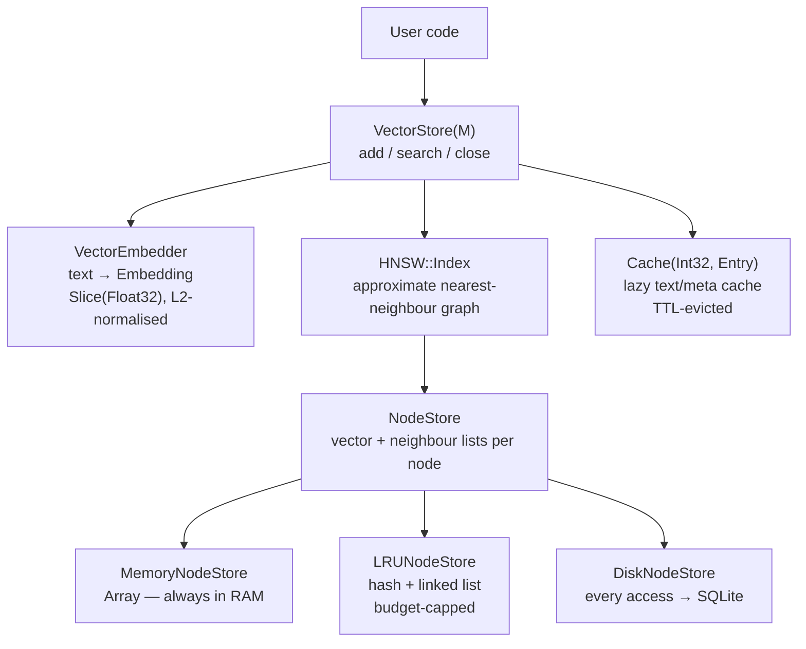
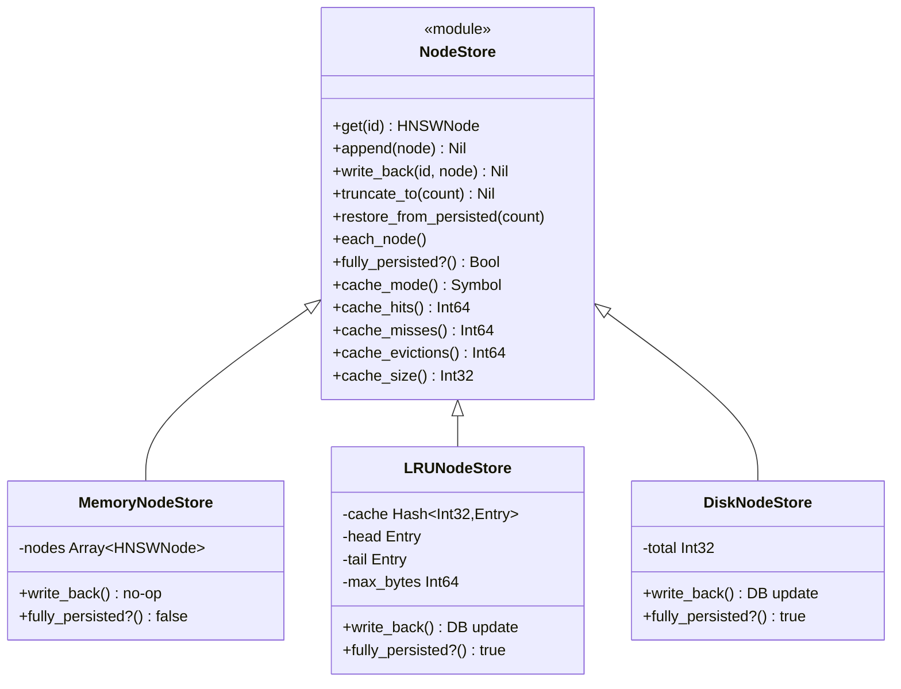
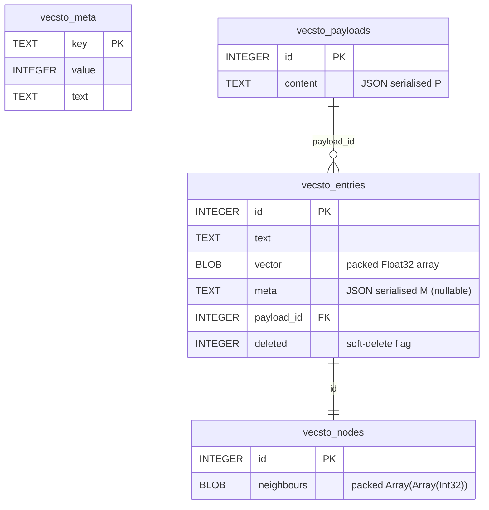
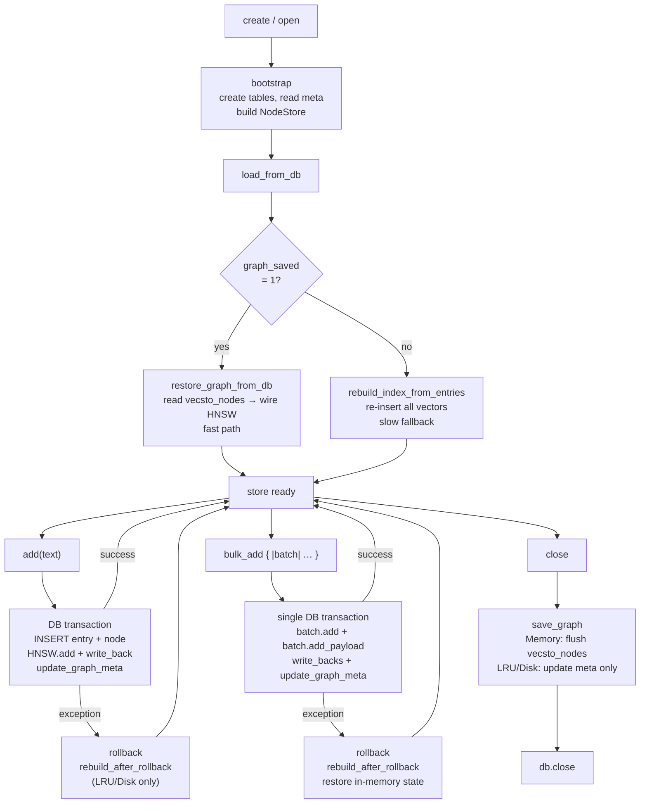

# Vecstolite Development

## Dependencies

1. Make sure you have `ops` installed, in one of the following ways:
 - as a gem via `gem install ops_team` or
 - as a tool via `brew tap nickthecook/crops && brew install ops`
2. If you not using macOS, or a Linux that uses `apt`, please [install Crystal](https://crystal-lang.org/install/)

## Getting started

|Command                        |Description                                                                       |
|-------------------------------|----------------------------------------------------------------------------------|
|`ops up`                       |Gets everything setup including `crystal` via `apt` or `brew` if applicable.      |
|`ops build-debug` or `ops bd`  |Make a debug build of `benchmark` sample, in `bin/debug` folder.                  |
|`ops build-release` or `ops br`|Make a release / production build of `benchmark` sample,  in `bin/release` folder.|
|`ops lint`                     |Run `ameba` on the source code                                                    |
|`ops clean`                    |Remove debug and release build files                                              |
|`ops wipe`                     |In addition to cleaning, remove all compiler caches                               |

### Build and run for development

Use `ops run samples/<SOURCEFILE>` to compile and run the specific source.

### Build to run later

Run `ops build-release` to make a release build in the `bin/release/` folder

Run `ops build-debug` to make a debug build in the `bin/debug/` folder

## Samples

### Benchmark

Using `ops bd` or `ops br` will build the `benchmark` sample app.

To run the benchmark you will need to inputs:

1. Path to a static embedder
2. Path to a text file containing sentences per line

The benchmark adds all the sentences, and then randomly samples 10% to search.

## How Vecstolite works

This section is for contributors. It describes the internal design in enough depth to orient an experienced Crystal developer who is new to the codebase.

### Bird's-eye view

Vecstolite's job is to:

1. Turn text into a fixed-length float vector (embedding).
2. Store that vector alongside its text and metadata.
3. At query time, find the stored vectors most similar to a query vector.

Steps 1–3 map to three layers: **embedders**, **stores**, and the **HNSW index**.



### Embeddings

`Embedding` is `Slice(Float32)` — a pointer + length struct pointing to a heap-allocated float buffer. All embeddings are L2-normalised on creation, so cosine similarity reduces to a dot product:

```
cosine_similarity(a, b) = dot(a, b)   # when ||a|| = ||b|| = 1
distance(a, b)          = 1 - dot(a, b)
```

`Slice` assignment copies the 16-byte struct (pointer + size), not the buffer — so passing embeddings around is cheap.

### HNSW index

The HNSW (Hierarchical Navigable Small World) index is an approximate nearest-neighbour graph. Each node lives at one or more layers; higher layers are sparser and act as express lanes for traversal.

**`HNSW::Index#add(id, vector)`** — inserts a new node:
1. Draw a random layer for the new node (`random_layer`; geometrically distributed, layer 0 most likely).
2. Descend from `@max_layer` to `node_layer + 1` using greedy single-hop descent (`greedy_descend`).
3. For each layer from `node_layer` down to 0, run a beam search (`search_layer`, beam width = `ef_construction`) to find the best neighbours, wire the new node's neighbour list, and wire back-edges on existing nodes.
4. Prune any neighbour list that exceeds `M` (or `M × 2` at layer 0).

**`HNSW::Index#search(query, k, ef)`** — approximate k-NN:
1. Greedy descent from `@max_layer` to layer 1 to find a good entry point.
2. Full beam search at layer 0 with beam width `max(ef, k)`.
3. Return the top-k candidates as `AnnResult(id, score)` where `score = 1 - distance`.

Key tuning parameters (set at `create` time, stored in DB):

|Parameter        |Default|Effect                                                                  |
|-----------------|-------|------------------------------------------------------------------------|
|`M`              |16     |Max neighbours per node per layer. Higher → better recall, more memory. |
|`ef_construction`|200    |Beam width during insert. Higher → better graph quality, slower inserts.|
|`ef_search`      |50     |Beam width during search. Higher → better recall, slower queries.       |

### NodeStore

`HNSW::Index` delegates all node storage through the `NodeStore` module. A node is `HNSWNode`: a vector (`Slice(Float32)`) and a per-layer neighbour list (`Array(Array(Int32))`).



**`MemoryNodeStore`** — `Array(HNSWNode)`, indexed by entry ID. `write_back` is a no-op because `HNSWNode` is a reference type; back-edge mutations are reflected in-place.

**`LRUNodeStore`** — a fixed-memory-budget cache backed by SQLite. Implemented as a `Hash(Int32, Entry)` for O(1) lookup plus a doubly-linked list for O(1) LRU promote/evict. Every `append` and `write_back` writes through to `vecsto_nodes`. On a cache miss, fetches both the vector (from `vecsto_entries`) and neighbour list (from `vecsto_nodes`) in a single JOIN. `fully_persisted?` returns `true` — the DB is always consistent; `save_graph` only needs to update meta.

**`DiskNodeStore`** — same write-through behaviour, zero in-memory cache. Every `get` hits the DB. Intended for memory-constrained environments doing infrequent searches on an already-built index; not suitable for bulk ingest.

### SQLitePayloadVectorStore

`SQLitePayloadVectorStore(M, P)` is the main store. Schema:



**`create` / `open`** call `bootstrap`, which creates tables if needed, reads meta, constructs the `NodeStore` (based on `cache_max_bytes`), and calls `load_from_db`.

**`load_from_db`** takes either the fast path (`restore_graph_from_db` — reads `vecsto_nodes` to wire HNSW without re-inserting) or the slow path (`rebuild_index_from_entries` — re-inserts all vectors; used when no graph has been saved yet).



**`add`** embeds the text, inserts into `vecsto_entries` and the HNSW index within a single transaction. For LRU/Disk stores, `HNSW::Index#add` calls `write_back` after each back-edge mutation, writing neighbour changes to `vecsto_nodes` in the same transaction. `update_graph_meta` is called at the end of each transaction so the DB is always crash-recoverable. If the transaction fails, `rebuild_after_rollback` restores the in-memory node store and index to match the rolled-back DB state, preventing stale LRU cache entries from corrupting subsequent adds.

**`bulk_add`** opens one transaction for the entire block. All `add_within_bulk` calls (entry inserts + index mutations) happen inside it. On success: one `fsync`. On exception: transaction rolls back, `rebuild_after_rollback` restores in-memory state to match.

**`save_graph`** — for MemoryNodeStore only: writes all neighbour lists to `vecsto_nodes` then updates meta. For LRU/Disk stores it only updates meta (nodes already persisted write-through).

**`close`** calls `save_graph` (if not readonly) then closes the DB connection.

### Entry cache vs NodeStore

Two separate caches serve different purposes and must not be confused:

|              |`@entry_cache`                                 |`NodeStore`                              |
|--------------|-----------------------------------------------|-----------------------------------------|
|Contents      |text, meta, payload_id                         |vector + neighbour lists                 |
|Access pattern|Top-k results only (after traversal)           |Every hop during traversal               |
|Eviction      |TTL (`cache_ttl` / `cache_purge_period`)       |LRU by byte budget                       |
|Implementation|`Cache(Int32, CachedEntry)` in `sucre/cache.cr`|`LRUNodeStore` in `sqlite3_node_store.cr`|

### Neighbour list packing

`NodePacking` in `sqlite3_node_store.cr` serialises `Array(Array(Int32))` to a compact little-endian BLOB:

```
[layer_count : Int32] [count₀ : Int32] [id₀ id₁ … : Int32…] [count₁ : Int32] …
```

One BLOB per node row in `vecsto_nodes`. This allows a single DB read to fetch a complete node.

### Durability model

- `PRAGMA journal_mode = WAL` — concurrent readers during writes.
- `PRAGMA synchronous = FULL` — every committed transaction is `fsync`'d.
- Entry rows and node rows are written in the same transaction, so the DB is always self-consistent at the row level.
- The HNSW graph topology (`@entry_point`, `@max_layer`, `graph_saved = 1`) is updated in the same transaction as the node write (LRU/Disk) or at `save_graph`/`close` (Memory). If the process crashes before `save_graph`, `load_from_db` falls back to `rebuild_index_from_entries` — slower but always correct.

---

## Design Decisions

Decisions that may look unconventional or prompt a "why didn't they just..." from a new contributor.

### `DB.connect` instead of `DB.open`

The Crystal DB documentation recommends using `DB::Database` (via `DB.open`) with a connection pool and threading `cnn = tx.connection` through every call inside a transaction block. We use `DB.connect` instead, which returns a single `DB::Connection` with no pool.

**Why:** SQLite is single-writer by design — a connection pool offers no concurrency benefit. More importantly, our transaction blocks call deep into `HNSW::Index#add` → `NodeStore#write_back` → `@db.exec`. Threading `tx.connection` through that entire call stack would couple the `NodeStore` abstraction to DB internals it has no business knowing about. A single `DB::Connection` ensures all exec calls automatically share the same connection and therefore the same transaction, with no API pollution.

The `tx.connection` pattern is designed for multi-connection databases (PostgreSQL, MySQL) where the pool is actually used. For SQLite it would be correct but unnecessarily invasive.

### `MemoryNodeStore` as the default for `SQLiteVectorStore`

`SQLiteVectorStore` (deprecated) uses `MemoryNodeStore` exclusively — no LRU or disk option. This is intentional: `SQLiteVectorStore` is being phased out in favour of `SQLitePayloadVectorStore`, so adding caching infrastructure to it would be wasted effort. New code should use `SQLitePayloadVectorStore`.

### Vectors stored twice in the original design (now fixed)

Prior to the `NodeStore` refactor (v0.5.2), embedding vectors were stored twice in memory: once in `@entry_embeddings` (an array of `EntryVector` structs) and again inside each `HNSWNode`. The `NodeStore` abstraction eliminated this by making the node the single owner of both vector and neighbour data. `Slice(Float32)` is a struct (pointer + size, 16 bytes), so assignment copies the struct only — not the underlying float buffer — but the redundant struct array still wasted memory and complicated ownership.

### `bulk_add` rollback rebuilds the in-memory index

When `bulk_add` fails and the DB transaction rolls back, the in-memory HNSW index and `NodeStore` have already been partially mutated. Rather than attempting to undo individual graph mutations (which would require tracking every back-edge change), `rebuild_after_rollback` discards the in-memory state entirely and reconstructs it from the now-clean database. This is O(n) in the pre-bulk entry count but correct by construction — the DB is the source of truth after a rollback.

### Thread safety is the caller's responsibility

No internal locking. Concurrent access to a store instance must be serialised by the application (e.g. with a `Mutex`). Adding a mutex inside the store would protect individual method calls but not compound operations (`size` + `add` atomically, for example), giving a false sense of safety. The application always knows its own concurrency shape; the store does not.

## Thread safety

Single-threaded only. See Design Decisions above.

## Contributions

See [README](./README.md)
