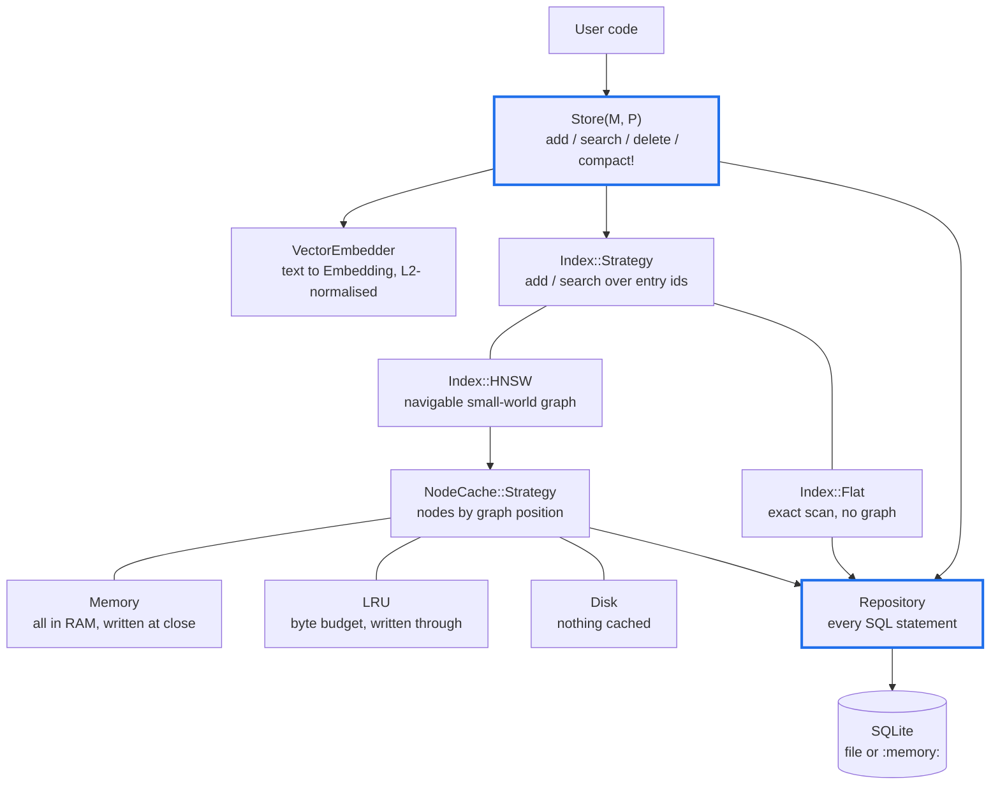
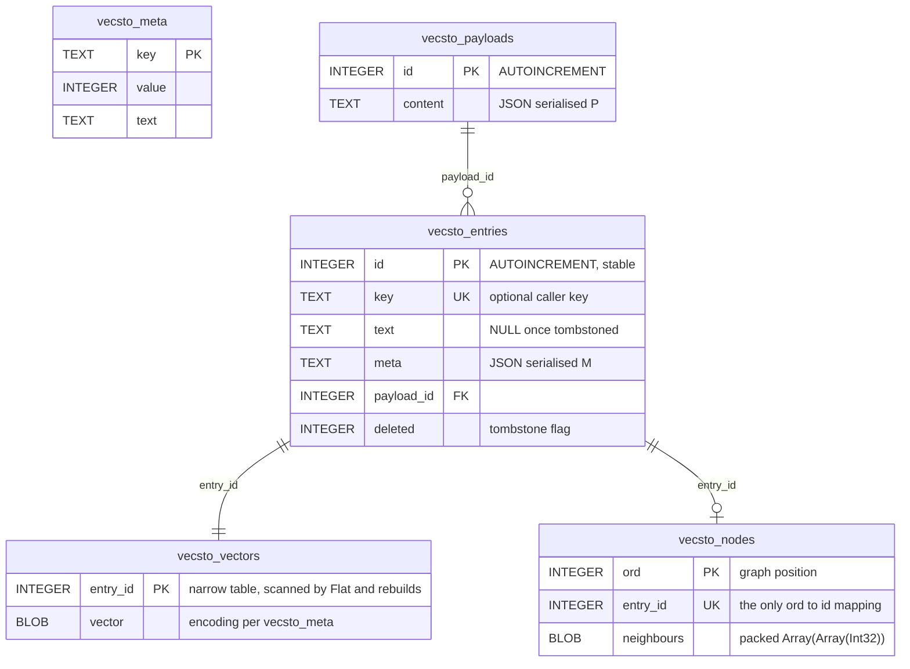

# Vecstolite Development

## Dependencies

1. Make sure you have `ops` installed, in one of the following ways:
 - as a gem via `gem install ops_team` or
 - as a tool via `brew tap nickthecook/crops && brew install ops`
2. If you not using macOS, or a Linux that uses `apt`, please [install Crystal](https://crystal-lang.org/install/)

## Getting started

Command                        |Description                                                                       
-------------------------------|----------------------------------------------------------------------------------
`ops up`                       |Gets everything setup including `crystal` via `apt` or `brew` if applicable.      
`ops build-debug` or `ops bd`  |Make a debug build of `benchmark` sample, in `bin/debug` folder.                  
`ops build-release` or `ops br`|Make a release / production build of `benchmark` sample,  in `bin/release` folder.
`ops lint`                     |Run `ameba` on the source code                                                    
`ops clean`                    |Remove debug and release build files                                              
`ops wipe`                     |In addition to cleaning, remove all compiler caches                               

### Build and run for development

Use `ops run samples/<SOURCEFILE>` to compile and run the specific source.

### Build to run later

Run `ops build-release` to make a release build in the `bin/release/` folder

Run `ops build-debug` to make a debug build in the `bin/debug/` folder

## Samples

Each sample is named for what it shows, and runs with `LexicalEmbedder`, so
none needs a model download.

### `quickstart`

The shortest path through the API: open, add, search, delete, compact, reopen.
Mirrors the README's quick start, so the README's code is known to compile.

### `translations`

Shared payloads: each language's text is its own entry, tagged with metadata,
all pointing at one translation set. Run with `-- --open` to reopen an
existing database rather than rebuild it.

### Benchmark

`samples/benchmark.cr` measures the things the design's sizing decisions rest
on. Six suites — `cache`, `footprint`, `ingest`, `restart`, `crossover`,
`compact` — or `all`:

```
crystal run samples/benchmark.cr --release -- crossover --sizes 1000,10000
```

It defaults to `LexicalEmbedder` over a synthetic corpus, so it runs anywhere;
`--model <dir>` switches to a real `StaticEmbedder`. Results print as markdown
tables. Record them below with the machine and Crystal version, since a number
without its conditions is not comparable with anything.

---

## How Vecstolite works

This section is for contributors. It describes the internal design in enough
depth to orient an experienced Crystal developer who is new to the codebase.

### Bird's-eye view

Vecstolite's job is to:

1. Turn text into a fixed-length float vector (embedding).
2. Store that vector alongside its text, metadata and any shared payload.
3. At query time, find the stored vectors most similar to a query vector.

There is one store class. How it searches, and how much it keeps in memory,
are arguments rather than separate classes.


```mermaid
flowchart TD
    APP["User code"]
    STORE["Store(M, P)
    add / search / delete / compact!"]
    EMB["VectorEmbedder
    text to Embedding, L2-normalised"]
    IDX["Index::Strategy
    add / search over entry ids"]
    FLAT["Index::Flat
    exact scan, no graph"]
    HNSW["Index::HNSW
    navigable small-world graph"]
    NC["NodeCache::Strategy
    nodes by graph position"]
    MEM["Memory
    all in RAM, written at close"]
    LRU["LRU
    byte budget, written through"]
    DSK["Disk
    nothing cached"]
    REPO["Repository
    every SQL statement"]
    DB[("SQLite
    file or :memory:")]

    APP --> STORE
    STORE --> EMB
    STORE --> IDX
    STORE --> REPO
    IDX --- FLAT
    IDX --- HNSW
    FLAT --> REPO
    HNSW --> NC
    NC --- MEM
    NC --- LRU
    NC --- DSK
    NC --> REPO
    REPO --> DB

    style STORE stroke:#1f6feb,stroke-width:3px
    style REPO stroke:#1f6feb,stroke-width:3px
```

**Ownership rules, which the layering exists to enforce:**

- `Repository` is the only object that writes SQL. It knows about rows and
  nothing about graphs, beams or embedding.
- An `Index::Strategy` knows about vectors and, if it keeps a graph, about
  positions within it. It speaks stable entry ids at its boundary.
- `Store` orchestrates, and owns every transaction boundary.

### Two id spaces

This is the first thing to understand, because everything else follows from
it.

Column|Owner |Lifetime                                        |Visible to caller
------|------|------------------------------------------------|-----------------
`id`  |caller|permanent; never reused                         |yes              
`key` |caller|optional, unique; supplied at `add`, for upserts|yes              
`ord` |index |graph position `0..n-1`; rewritten by `compact!`|no               

HNSW needs contiguous positional ids that compaction renumbers. Callers need
ids that never move. An analogy: `id` is a passport number, `ord` is a seat on
today's flight. `compact!` reseats everyone; nobody's passport changes.

`vecsto_nodes` is the only place the two meet — it maps one `ord` to one
`entry_id`. `vecsto_entries` has no `ord` column at all, so the two cannot
drift apart.

### Schema


```mermaid
erDiagram
    vecsto_meta {
        TEXT key PK
        INTEGER value
        TEXT text
    }
    vecsto_payloads {
        INTEGER id PK "AUTOINCREMENT"
        TEXT content "JSON serialised P"
    }
    vecsto_entries {
        INTEGER id PK "AUTOINCREMENT, stable"
        TEXT key UK "optional caller key"
        TEXT text "NULL once tombstoned"
        TEXT meta "JSON serialised M"
        INTEGER payload_id FK
        INTEGER deleted "tombstone flag"
    }
    vecsto_vectors {
        INTEGER entry_id PK "narrow table, scanned by Flat and rebuilds"
        BLOB vector "encoding per vecsto_meta"
    }
    vecsto_nodes {
        INTEGER ord PK "graph position"
        INTEGER entry_id UK "the only ord to id mapping"
        BLOB neighbours "packed Array(Array(Int32))"
    }

    vecsto_payloads ||--o{ vecsto_entries : "payload_id"
    vecsto_entries  ||--|| vecsto_vectors : "entry_id"
    vecsto_entries  ||--o| vecsto_nodes   : "entry_id"
```

Vectors live in their own narrow table for one reason: SQLite stores a row's
columns contiguously, so a vector sharing a row with `text` and `meta` drags
both through the page cache on every scan. Splitting them is like being asked
to count heads without carrying everyone's luggage. Both scan-shaped
workloads — exact search and metadata filtering — get cheaper from it.

`vecsto_meta` carries `schema_version`, `dimensions`, `encoding`, `embedder`,
`index_kind`, `m`, `ef_construction`, `entry_point`, `max_layer`,
`graph_saved` and `live_count`.

### Embeddings

`Embedding` is `Slice(Float32)` — a pointer plus length, so passing one around
copies 16 bytes rather than the buffer. Every embedder must return
L2-normalised vectors, which is what reduces cosine similarity to a dot
product:

```
cosine_similarity(a, b) = dot(a, b)   # when ||a|| = ||b|| = 1
distance(a, b)          = 1 - dot(a, b)
```

`VectorEmbedder#l2_normalize!` is shared, and `dimensions` must report what
`embed` actually returns — a truncated model reports the truncated width, not
the model's native one, because a store writes that number into its metadata
and validates every vector against it.

### Index strategies

**`Index::Flat`** scans every live vector. Exact, O(n) per query, no graph to
build or persist, nothing to rebuild after an unclean exit. Its roles are
small stores and serving as the oracle a recall harness measures HNSW
against.

**`Index::HNSW`** walks a hierarchical navigable small-world graph. Nodes sit
at one or more layers; upper layers are sparse and act as express lanes.

`add(entry_id, vector)`:

1. Draw a layer for the new node (`random_layer`).
2. Descend greedily from `max_layer` to `node_layer + 1`.
3. From the new node's top layer down to 0, beam search with width
   `ef_construction`, choose neighbours, and wire back-edges.
4. Prune any neighbour list over its limit (`m`, or `m × 2` at layer 0).

`search(vector, k, ef)` descends greedily to layer 1, beam searches layer 0
with width `max(ef, k)`, and maps each result back to its entry id.

Parameter        |Default|Effect                                                                            
-----------------|-------|----------------------------------------------------------------------------------
`m`              |16     |Neighbours per node per layer. Higher: better recall, more memory, slower inserts.
`ef_construction`|200    |Beam width while inserting. Higher: better graph, slower ingest.                  
`ef_search`      |50     |Beam width per query. Higher: better recall, slower queries.                      

### Node caching

`Index::HNSW` reaches nodes only through a `NodeCache::Strategy`, which
assigns graph positions and decides what stays in RAM.

Strategy|Holds         |Writes                    |Costs                        
--------|--------------|--------------------------|-----------------------------
`Memory`|every node    |at `flush`                |unclean exit forces a rebuild
`LRU`   |up to a budget|through, on every mutation|a read per miss              
`Disk`  |nothing       |through                   |a read per node visit        

A node is `Index::Node`: a vector and `neighbours[layer]`. Nodes are reference
types, so a strategy that mutates one must hand it back via `write_back` for
the change to reach storage — and `LRU#write_back` reseats the cache to the
object it just persisted. That last detail is not fussiness: without it, a
node evicted mid-insert could be read back with empty neighbour lists, and a
later write of that stale copy would strip the node's edges from the graph
entirely.

### Neighbour packing

Neighbour lists are packed into one BLOB per node, little-endian `Int32`
throughout:

```
[layer_count] [count0 id id ...] [count1 id id ...] ...
```

### Durability

- `PRAGMA journal_mode = WAL`, `PRAGMA synchronous = FULL`.
- **One rule:** any operation that changes the `ord` space or the graph
  topology writes its graph metadata — `entry_point`, `max_layer`,
  `graph_saved`, `live_count` — inside the same transaction as the rows those
  values describe.
- If `graph_saved` is 0 at open, or the stored `index_kind` differs from the
  one requested, the graph is rebuilt from `vecsto_vectors`. Slower, always
  correct.

---

## Design Decisions

Decisions that may look unconventional or prompt a "why didn't they just..."
from a new contributor.

### `DB.connect` instead of `DB.open`

The Crystal DB documentation recommends `DB::Database` (via `DB.open`) with a
connection pool, threading `cnn = tx.connection` through every call inside a
transaction block. We use `DB.connect`, which returns a single
`DB::Connection` with no pool.

**Why:** SQLite is single-writer by design, so a pool offers no concurrency
benefit. More importantly, a transaction here spans `Store` → `Index` →
`NodeCache` → `Repository`; threading `tx.connection` through that stack would
couple every layer to DB internals it has no business knowing about. A single
connection makes every `exec` share the same transaction with no API
pollution.

`":memory:"` must be percent-encoded in the connection URI
(`sqlite3://%3Amemory%3A`), or its colons parse as a port.

### Stable ids and private graph positions

Callers get `id` and optional `key`; the index gets `ord`. The alternative —
exposing positional ids, as 0.6.x did — means compaction renumbers everything
a caller might be holding, which in turn means `compact!` cannot be run
casually and search results cannot be used to delete what they found.

Keying `vecsto_vectors` by `entry_id` rather than `ord` follows from the same
choice: vectors never move, so compaction rewrites only the small nodes table
it was going to rebuild anyway.

### Deletion is a tombstone, compaction is deferred

Removing a node from an HNSW graph means patching every back-edge that points
at it. Worse, a deleted node's *edges* vanish with it, and upper-layer nodes
are the express lanes — removing one can sever the only route to a live
region, silently, with nothing raising.

So `delete` tombstones: `deleted = 1`, with `text`, `meta` and `payload_id`
released immediately. The node stays wired in as a routing waypoint, which is
why node reads deliberately do **not** filter on `deleted`. Filtering happens
at the result layer, where `search` oversamples to replace tombstoned hits —
capped by `oversample_rounds` (3 unless set at open), so a heavily tombstoned
store returns a short result rather than escalating to a whole-graph scan on
every query.

`compact!` is the only thing that physically removes tombstones, and it is
deliberately manual: a batch of deletes then one `compact!` costs one rebuild,
where compacting per delete would cost one apiece. Because `ord` is private,
compaction is invisible to callers — ids and keys survive it untouched.

### A failed write rebuilds the index

A rolled-back transaction restores the rows but not the strategy's in-memory
state. Rather than tracking and undoing individual graph mutations, `Store`
discards the index and rebuilds from the surviving vectors. O(n), and correct
by construction: after a rollback the database is the source of truth.

### Neighbours are chosen for diversity, not proximity alone

Taking simply the nearest `m` candidates leaves a node in a dense cluster with
every edge pointing inward, and a search that arrives there has no road out.
Selection instead keeps a candidate only when it is at least as close to the
node being linked as to any neighbour already chosen, with rejected candidates
filling any remaining slots so no node ends up with fewer edges than it would
have had.

"At least as close" matters. Identical vectors sit at distance zero from each
other and from the node, so a strict comparison rejects every copy after the
first as redundant, and copies end up linked by a single edge. With repeated
content — a translation memory holding the same segment many times — a search
then found only four copies in five. With ties kept, it finds all of them.
This matches hnswlib.

This is not a refinement. Measured against an exact scan on clustered data
(2,000 vectors, 32 dimensions, 50 clusters, m=8, ef_construction=64, ef=5,
k=5), recall moved as follows:

&nbsp;              |layer p = 1/e|layer p = 1/m
--------------------|-------------|-------------
nearest-m neighbours|0.752        |0.572        
diversity neighbours|0.936        |**0.976**    

The bottom-left and top-right cells are why both changes had to be measured
together. The layer draw is the textbook one — a node reaches layer 1 with
probability 1/m — but judged on its own it looked like a 24% regression,
because the surplus upper layers had been compensating for a base graph whose
edges all pointed inward. `spec/unit/index/hnsw_spec.cr` keeps this honest:
`RECALL_FLOOR` guards against regression, and a companion assertion fails if
recall ever reaches a perfect 1.0, which would mean the harness had stopped
measuring anything.

### Thread safety is the caller's responsibility

No internal locking. Concurrent access must be serialised by the application
(a `Mutex`, say). A mutex inside the store would protect individual calls but
not compound operations — `size` then `add` atomically, for instance — giving
a false sense of safety. The application knows its own concurrency shape; the
store does not.

---

## Measurements

Benchmark results, with the conditions that produced them. Replace rather than
append: a stale number is worse than none.

### Flat against HNSW

Crystal 1.21.0, `LexicalEmbedder` at 768 dimensions, synthetic corpus, seeded
graph, 50 queries at k=5.

corpus|strategy|per query|recall (ids)|recall (scores)|database
-----:|--------|--------:|-----------:|--------------:|-------:
  1000|flat    |  6.50 ms|       1.000|          1.000|  4.1 MB
  1000|hnsw    |  0.13 ms|       0.504|          0.960|  4.2 MB
 10000|flat    | 45.36 ms|       1.000|          1.000| 40.1 MB
 10000|hnsw    |  0.31 ms|       0.712|          0.960| 41.7 MB

Two readings matter here.

**The graph wins at every size.** 50× at a thousand entries, 150× at ten
thousand. The crossover sits below a thousand, so there is no corpus size at
which defaulting to an exact scan makes sense. `Flat` is the exact option and
the oracle, not a small-store default.

**The two recall columns disagree, and the second is the honest one.**
`LexicalEmbedder` produces sparse hashed bag-of-words vectors, so many entries
score *exactly* equal against a query. Flat and HNSW then each return a
different, equally correct five, and set overlap counts that as a miss.
Anyone benchmarking a vector store with id-overlap recall on sparse
embeddings will reach the same wrong conclusion.

---

## Thread safety

Single-threaded only. See Design Decisions above.

## Contributions

See [README](./README.md)
