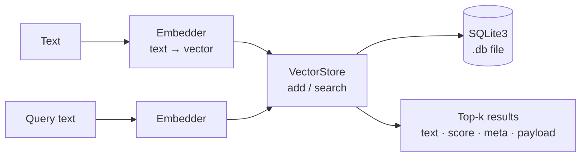

# Vecstolite

A vector embedding-based storage _shard_ for Crystal with in-memory and SQLite3 back-ends.

> See [DISCLOSURE.md](./DISCLOSURE.md) for how AI is used in this project.

## Installation

1. Add the dependency to your `shard.yml`:

```yml
dependencies:
  vecstolite:
    github: nogginly/vecstolite.cr
```

2. Run `shards install`

## Usage

### Quick start

The fastest way to get started is with a `StaticEmbedder` (no server or GPU required) and a persistent `SQLitePayloadVectorStore`. The static embedder runs entirely locally using a downloaded model file.



```cr
require "vecstolite"

# 1. Load a local embedding model (WordPiece-based safetensors format).
#    Download from HuggingFace — see "Embedders" below for tested models.
embedder = Vecstolite::StaticEmbedder.load("/path/to/model")

# 2. Create a persistent store (or open an existing one).
store = Vecstolite::SQLitePayloadVectorStore(String, String)
          .create("my_store.db", embedder)
# store = Vecstolite::SQLitePayloadVectorStore(String, String)
#           .open("my_store.db", embedder)

# 3. Add text.
store.add("The sky is blue during a clear day.")
store.add("Roses are red and violets are blue.")
store.add("Crystal is a statically typed language with Ruby-like syntax.")
store.add("A transformer is a type of neural network architecture.")

# 4. Search.
store.search("colour of the sky", k: 3).each do |r|
  puts "[#{r.score.round(4)}] #{r.text}"
end

# 5. Close (flushes the graph to disk).
store.close
```

That's it. On the next run, replace `.create` with `.open` and skip step 3.

### Embedders

#### Static (local, no server)

```cr
embedder = Vecstolite::StaticEmbedder.load(MODEL_PATH)
```

`MODEL_PATH` must contain `model.safetensors` and `tokenizer.json`. Tested models (download from HuggingFace):

- [`static-retrieval-mrl-en-v1`](https://huggingface.co/sentence-transformers/static-retrieval-mrl-en-v1) — English only, fast
- [`static-similarity-mrl-multilingual-v1`](https://huggingface.co/sentence-transformers/static-similarity-mrl-multilingual-v1) — multilingual

> Only WordPiece tokenizers are supported.

#### OpenAI-protocol (Ollama, OpenAI, etc.)

```cr
embedder = Vecstolite::OpenAIEmbedder.new(
  dimensions: 768,
  base_url:   "http://localhost:11434",
  api_key:    "ollama",
  model:      "nomic-embed-text-v2-moe",
)
```

Any server that speaks the OpenAI embeddings API works here.

### Vector stores

|Store                           |Backing |Notes                                          |
|--------------------------------|--------|-----------------------------------------------|
|`MemoryVectorStore`             |RAM only|Simple; no persistence                         |
|`SQLitePayloadVectorStore(M, P)`|SQLite3 |Recommended; typed meta + shared payloads      |
|`SQLiteVectorStore`             |SQLite3 |**Deprecated** — use `SQLitePayloadVectorStore`|

#### `MemoryVectorStore`

```cr
store = Vecstolite::MemoryVectorStore.new(embedder)
store.add("The sky is blue.")
results = store.search("sky colour", k: 3)
```

#### `SQLitePayloadVectorStore(M, P)`

`M` is per-embedding metadata; `P` is a shared payload (many embeddings can reference one payload). Both must be `JSON::Serializable`.

```cr
record Lang, code : String do
  include JSON::Serializable
end

record Translation, en : String, fr : String do
  include JSON::Serializable
end

store = Vecstolite::SQLitePayloadVectorStore(Lang, Translation)
          .create("translations.db", embedder)

# Store a shared payload, then index it in multiple languages.
t = Translation.new(en: "The sky is blue.", fr: "Le ciel est bleu.")
pid = store.add_payload(t)
store.add(t.en, meta: Lang.new("en"), payload_id: pid)
store.add(t.fr, meta: Lang.new("fr"), payload_id: pid)

# Search returns the matched embedding plus its resolved payload.
store.search("ciel", k: 2).each do |r|
  puts "[#{r.score.round(4)}] (#{r.meta.try(&.code)}) #{r.text}"
  puts "  → EN: #{r.payload.try(&.en)}"
end

store.close
```

##### Bulk insert

For large ingest jobs, `bulk_add` wraps all inserts in a single transaction — significantly faster than individual `add` calls for 100+ entries. Payloads can be created inside the block too, so everything commits or rolls back as one unit:

```cr
store.bulk_add do |batch|
  inputs.each do |input|
    pid = batch.add_payload(input.translation)
    batch.add(input.en, meta: Lang.new("en"), payload_id: pid)
    batch.add(input.fr, meta: Lang.new("fr"), payload_id: pid)
  end
end
```

If the block raises, the transaction is rolled back — no orphaned payload rows, no partial index.

##### Memory modes

```cr
# Default (512 MB LRU cache — balanced):
store = Vecstolite::SQLitePayloadVectorStore(M, P).create(path, embedder)

# Larger or smaller budget:
store = Vecstolite::SQLitePayloadVectorStore(M, P).create(path, embedder,
          cache_max_bytes: 256 * Vecstolite::MB)

# No cache — minimal RAM, slower search:
store = Vecstolite::SQLitePayloadVectorStore(M, P).create(path, embedder,
          cache_max_bytes: nil)

# After open, load the full index into RAM for maximum search speed:
store.load_all_in_memory!
```

### Searching

```cr
results = store.search("What is the colour of the sky?", k: 3)
results.each { |r| puts "[#{r.score.round(4)}] #{r.text}" }
```

`results` is an `Array` of objects that include `VectorSearchResult` (`text`, `score`). `SQLitePayloadVectorStore` results also carry `meta` and `payload`.

To tune recall vs speed, pass `ef_search` explicitly (higher = better recall, slower):

```cr
results = store.search("sky colour", k: 5, ef_search: 100)
```

## Development

See [DEVELOPMENT.md](./DEVELOPMENT.md) for how to build, run the samples, and understand the internals.

## Contributions, by invitation!

*With apologies*, at this time contributions are *by invitation only* and limited to people I know and see often.

These are early days for _Vecstolite_ and I am busy with family and work.

At this time I want to work on this at a manageable pace.
