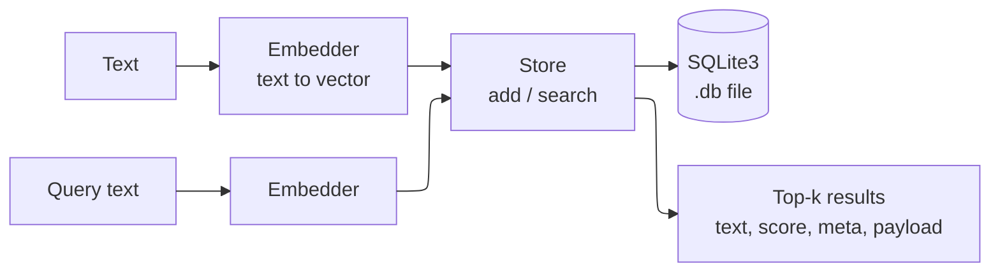

# Vecstolite

A vector store _shard_ for Crystal, backed by SQLite3 on disk or in memory.

> See [DISCLOSURE.md](./DISCLOSURE.md) for how AI is used in this project.

## Installation

1. Add the dependency to your `shard.yml`:

```yml
dependencies:
  vecstolite:
    github: nogginly/vecstolite.cr
```

2. Run `shards install`

## Usage

### Quick start

The fastest way to begin is a `StaticEmbedder`, which runs locally from a
downloaded model with no server or GPU, and a store on disk.


```mermaid
---
config:
  layout: elk
---
flowchart LR
    T["Text"] --> E["Embedder
    text to vector"]
    E --> S["Store
    add / search"]
    S --> DB[("SQLite3
    .db file")]
    Q["Query text"] --> E2["Embedder"]
    E2 --> S
    S --> R["Top-k results
    text, score, meta, payload"]
```

```cr
require "vecstolite"

embedder = Vecstolite::StaticEmbedder.load("/path/to/model")

Vecstolite::Store(String, String).open("my_store.db", embedder) do |store|
  store.add("The sky is blue during a clear day.")
  store.add("Roses are red and violets are blue.")
  store.add("Crystal is a statically typed language with Ruby-like syntax.")

  store.search("colour of the sky", k: 2).each do |result|
    puts "[#{result.score.round(4)}] #{result.text}"
  end
end
```

`open` creates the database if it is missing. The block form closes the store
— flushing anything held in memory — even if the block raises. Without a
block, call `close` yourself.

> Databases written by 0.6.x cannot be opened by 0.7. Recreate them by
> re-running your ingest.

### Embedders

#### Static (local, no server)

```cr
embedder = Vecstolite::StaticEmbedder.load(MODEL_PATH)

# Matryoshka models can be truncated for smaller vectors:
embedder = Vecstolite::StaticEmbedder.load(MODEL_PATH, truncate_dims: 256)
```

`MODEL_PATH` must contain `model.safetensors` and `tokenizer.json`. Tested
models, from HuggingFace:

- [`static-retrieval-mrl-en-v1`](https://huggingface.co/sentence-transformers/static-retrieval-mrl-en-v1) — English only, fast
- [`static-similarity-mrl-multilingual-v1`](https://huggingface.co/sentence-transformers/static-similarity-mrl-multilingual-v1) — multilingual

> Only WordPiece tokenizers are supported.

#### OpenAI-protocol (Ollama, OpenAI, and others)

```cr
embedder = Vecstolite::OpenAIEmbedder.new(
  dimensions: 768,
  base_url:   "http://127.0.0.1:11434",
  api_key:    "ollama",
  model:      "nomic-embed-text-v2-moe",
)
```

Any server that speaks the OpenAI embeddings API works. Vectors are
normalised on arrival, so a server that doesn't return unit vectors still
produces correct scores. Batch ingest (below) sends one request per batch
rather than one per entry.

#### Writing your own

Include `Vecstolite::VectorEmbedder` and implement `model_name`, `dimensions`
and `embed`. Two obligations: `embed` must return an L2-normalised vector
(`l2_normalize!` is provided), and `dimensions` must report what `embed`
actually returns. Override `embed_all` if your model can embed in batches.

A store records its embedder's name and dimensions, and refuses to open with a
different one: vectors from different models are not comparable, and mixing
them produces results that look plausible and are wrong. Pass
`verify_embedder: false` only if you know otherwise.

### Entries, metadata and payloads

`Store(M, P)` takes two types. `M` is per-entry metadata; `P` is a payload
several entries can share. Both must round-trip through JSON —
`JSON::Serializable`, a `Hash`, or a primitive.

```cr
record Lang, code : String do
  include JSON::Serializable
end

record Translation, en : String, fr : String do
  include JSON::Serializable
end

store = Vecstolite::Store(Lang, Translation).open("translations.db", embedder)

pair = Translation.new(en: "The sky is blue.", fr: "Le ciel est bleu.")
pid = store.add_payload(pair)
store.add(pair.en, meta: Lang.new("en"), payload_id: pid)
store.add(pair.fr, meta: Lang.new("fr"), payload_id: pid)

store.search("ciel", k: 2).each do |result|
  puts "[#{result.score.round(4)}] (#{result.meta.try(&.code)}) #{result.text}"
  puts "  EN: #{result.payload.try(&.en)}"
end
```

`add` returns the entry's id. **Ids are stable**: they survive deletion of
other entries and compaction, and are never reused. You can also give an entry
a key of your own, unique within the store:

```cr
id = store.add("The sky is blue.", key: "doc-42#chunk-3")
store.get(id)                         # => Entry, or nil
store.get_by_key("doc-42#chunk-3")    # => the same Entry
```

If you already have an embedding, pass it and skip the embedder:

```cr
store.add("The sky is blue.", vector: precomputed)
store.search_vector(query_vector, k: 3)
```

### Bulk ingest

`bulk` adds everything in one transaction — entries and any payloads they
share. Embedding happens *before* the transaction opens, in one call to
`embed_all`, so a slow or remote embedder never holds the database's write
lock.

A payload added to a batch has no id until the batch commits, so
`add_payload` returns a placeholder that `add` accepts in its place:

```cr
store.bulk do |batch|
  inputs.each do |input|
    pair = batch.add_payload(input.translation)
    batch.add(input.en, meta: Lang.new("en"), payload_id: pair)
    batch.add(input.fr, meta: Lang.new("fr"), payload_id: pair)
  end
end
```

Existing payload ids work too. If anything fails, the whole batch rolls back —
payloads included — and the store is left as it was.

### Searching

```cr
results = store.search("What is the colour of the sky?", k: 3)
```

Each result carries `id`, `key`, `text`, `score` (cosine similarity, 1.0 for
identical), `meta`, `payload_id` and `payload`. Payloads shared by several
results are fetched once.

To trade speed for recall, widen the search beam:

```cr
results = store.search("sky colour", k: 5, ef_search: 100)
```

### Deleting and compacting

```cr
store.delete(id)                  # one entry
store.delete_by_key("doc-42#chunk-3")
store.delete_payload(pid)         # a payload and every entry using it
store.compact!                    # reclaim the space
```

Deletion is immediate as far as searches, `get` and `size` are concerned. The
space is reclaimed later: a deleted entry stays wired into the search graph as
a route to its neighbours until `compact!` rebuilds the graph without it.

Compact after a batch of deletions, not after each one — it rebuilds the
graph, so its cost is the same whether one entry was deleted or a thousand.
Ids and keys are unaffected by compaction.

A store with many uncompacted deletions returns fewer than `k` results rather
than slowing down to find more. `store.tombstones` says how many are pending.

### Index strategies

```cr
Vecstolite::Store(M, P).open(path, embedder, index: Vecstolite::Index.hnsw)
Vecstolite::Store(M, P).open(path, embedder, index: Vecstolite::Index.flat)
```

**`Index.hnsw`** (the default) searches a navigable graph: approximate, and
fast at every size. Its parameters trade build time and memory for recall:

Parameter        |Default|Higher means                                       
-----------------|------:|---------------------------------------------------
`m`              |     16|better recall, more memory, slower ingest          
`ef_construction`|    200|better graph, slower ingest                        
`ef_search`      |     50|better recall, slower queries (a `search` argument)

**`Index.flat`** scans every entry: exact, with nothing to build or rebuild.
It is not a small-store optimisation — measured at 768 dimensions, the graph
is some 50 times faster at a thousand entries — but it is the right choice
when you need exact results, and it is what the graph's accuracy is measured
against.

Reopening a store with a different strategy rebuilds the index from the stored
vectors.

### Memory

```cr
Vecstolite::CacheMode.lru(256 * Vecstolite::MB)  # default: bounded, written through
Vecstolite::CacheMode.memory                     # whole graph in RAM
Vecstolite::CacheMode.disk                       # nothing cached
```

Pass one as `cache:` when opening.

- **`lru`** holds as much of the graph as its budget allows and writes every
  change straight to disk. The right default, and the right choice for
  anything long-lived or restarted often.
- **`memory`** is fastest, but writes the graph only when the store closes. If
  the process exits without closing, the next open rebuilds the graph from the
  stored vectors — so it suits batch jobs that end cleanly.
- **`disk`** keeps nothing in memory and reads from the database on every
  step.

> **Sizing.** Guidance on budget per thousand entries is pending benchmark
> results.

The cache budget covers graph nodes only. SQLite keeps its own page cache per
open store, 2 MB by default, set with `page_cache_bytes:`. If you run many
stores in one process, count both.

### Reading only

```cr
store = Vecstolite::Store(M, P).open(path, embedder, readonly: true)
```

A readonly store raises on any write. It also cannot rebuild its index, so it
refuses to open a store whose graph was not saved cleanly.

### Concurrency

A store is single-threaded. If several fibres share one, serialise access
yourself — with a `Mutex`, for example. Internal locking would protect
individual calls but not sequences of them, giving a false sense of safety.

## Development

See [DEVELOPMENT.md](./DEVELOPMENT.md) for how to build, run the samples, and understand the internals.

## Contributions, by invitation!

*With apologies*, at this time contributions are *by invitation only* and limited to people I know and see often.

These are early days for _Vecstolite_ and I am busy with family and work.

At this time I want to work on this at a manageable pace.
